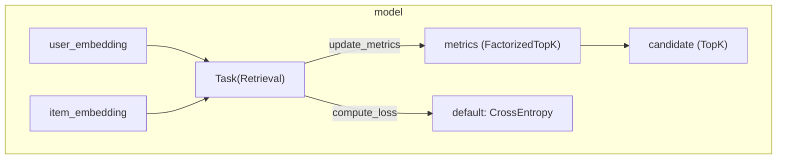

## このページで学べること

TensorFlow Recommendersの以下のページのExampleを通じてRecommendersの重要コンポーネントを理解する

https://www.tensorflow.org/recommenders/examples/basic_retrieval

## まとめ

今回のRetrievalについて




1. データ: movielensのratingsのデータ
1. モデル学習: user_idとmovie titleからembeddingを作成し、内積を取るTwo-towerモデル
    1. モデルを学習するとuser_embeddingとmovie_embeddingが得られる
1. 使い方: 最終的に使うときは、ScaNNなどのIndexを作成して、与えられたUserIdに対してEmbeddingの近いMovie (Userも可)を返す
    1. candidateは、query_modelで初期化され、与えられたqueryをembeddingに変換し、近いTopKのscore (tensor)とindex (tensor)を返す


## はじめに

### TensorFlow Recommenders

TensorFlowで推薦システムを構築する際に使えるライブラリ

https://github.com/tensorflow/recommenders

:::note warn
最終リリース[v0.7.3](https://github.com/tensorflow/recommenders/releases/tag/v0.7.3)は2023/2/3で、1年半以上リリースされていないのでこのライブラリを使うかどうかは注意が必要
:::

### [tfrs.Model](https://github.com/tensorflow/recommenders/blob/5e0629cf10de22ef7ee38038cb1b22925ed822db/tensorflow_recommenders/models/base.py#L21)

`tf.keras.Model` を軽くWrapしたClass

>  Many recommender models are relatively complex, and do not neatly fit into
>  supervised or unsupervised paradigms. This base class makes it easy to
>  define custom training and test losses for such complex models.

シンプルに`compute_loss`を定義するだけで、内部的に`train_step`と`test_step`から`compute_loss`を呼び出して使ってくれるので、シンプルな推薦モデル作成に使えるクラス


使い方:
- `__init__`でモデルをセットする (Variable, task, loss, metricの初期化も)
- `compute_loss`でtraining lossを定義する
- (Optional) `call`で、 predictionでの計算を定義する


`tf.keras.Model` 内に定義されている`train_step`:

```py
  def train_step(self, inputs):
    """Custom train step using the `compute_loss` method."""

    with tf.GradientTape() as tape:
      loss = self.compute_loss(inputs, training=True)

      # Handle regularization losses as well.
      regularization_loss = tf.reduce_sum(
          [tf.reduce_sum(loss) for loss in self.losses]
      )

      total_loss = loss + regularization_loss

    gradients = tape.gradient(total_loss, self.trainable_variables)
    self.optimizer.apply_gradients(zip(gradients, self.trainable_variables))

    metrics = {metric.name: metric.result() for metric in self.metrics}
    metrics["loss"] = loss
    metrics["regularization_loss"] = regularization_loss
    metrics["total_loss"] = total_loss

    return metrics
```

`tf.keras.Model` 内に定義されている`test_step`:

```py
  def test_step(self, inputs):
    """Custom test step using the `compute_loss` method."""

    loss = self.compute_loss(inputs, training=False)

    # Handle regularization losses as well.
    regularization_loss = tf.reduce_sum(
        [tf.reduce_sum(loss) for loss in self.losses]
    )

    total_loss = loss + regularization_loss

    metrics = {metric.name: metric.result() for metric in self.metrics}
    metrics["loss"] = loss
    metrics["regularization_loss"] = regularization_loss
    metrics["total_loss"] = total_loss

    return metrics
```

詳細実装は[GitHub](https://github.com/tensorflow/recommenders/blob/5e0629cf10de22ef7ee38038cb1b22925ed822db/tensorflow_recommenders/models/base.py)

### Retrieval

Recommendationでは、RetrievalコンポーネントとRankコンポーネントからなることが多いので、Retrievalコンポーネントを実装するときに使える。

今回はこのRetrievalにFocusを絞ってみていく

## [tfrs.tasks.Retrieval](https://github.com/tensorflow/recommenders/blob/5e0629cf10de22ef7ee38038cb1b22925ed822db/tensorflow_recommenders/tasks/retrieval.py#L27)

### tfrs.tasks.Retrievalの使われ方

まずはRetrievalがどのように使われているのかを見てから、Retrievalの中身をみていく。

https://www.tensorflow.org/recommenders/examples/quickstart で使われている

```py
# Define your objectives.
task = tfrs.tasks.Retrieval(metrics=tfrs.metrics.FactorizedTopK(
    movies.batch(128).map(movie_model)
  )
)
```

これをモデル `tfrs.Model` に渡して初期化する。

```py
class MovieLensModel(tfrs.Model):
  # We derive from a custom base class to help reduce boilerplate. Under the hood,
  # these are still plain Keras Models.

  def __init__(
      self,
      user_model: tf.keras.Model,
      movie_model: tf.keras.Model,
      task: tfrs.tasks.Retrieval):
    super().__init__()
```

実際に使われるのは、`compute_loss`の中で、user_embeddingsとmovie_embeddingsを引数にとって、lossが計算されている。

定義したuser_modelとmovie_modelからembeddingを取得して、task内でlossを計算している。

```py
  def compute_loss(self, features: Dict[Text, tf.Tensor], training=False) -> tf.Tensor:
    # Define how the loss is computed.

    user_embeddings = self.user_model(features["user_id"])
    movie_embeddings = self.movie_model(features["movie_title"])

    return self.task(user_embeddings, movie_embeddings)
```

実際にどのようにlossが計算されているのかがわからないので、以下のセクションで見てみる

### Retrievalの定義

次に、Retrievalの定義を見て理解を深めていく

```py
class Retrieval(tf.keras.layers.Layer, base.Task):
  """A factorized retrieval task.

  Recommender systems are often composed of two components:
  - a retrieval model, retrieving O(thousands) candidates from a corpus of
    O(millions) candidates.
  - a ranker model, scoring the candidates retrieved by the retrieval model to
    return a ranked shortlist of a few dozen candidates.

  This task defines models that facilitate efficient retrieval of candidates
  from large corpora by maintaining a two-tower, factorized structure: separate
  query and candidate representation towers, joined at the top via a lightweight
  scoring function.
  """
```

queryとcandidateの2つのタワーからなるTwo-towerをTopでJoinさせてスコアリングするモデルで簡単に効率的に候補を取り出すタスクを定義する。

### 初期化時に与えることができるもの

- loss: default は`tf.keras.losses.CategoricalCrossentropy`
- metrics: Object for evaluating top-K metrics over a corpus of candidates.
- batch_metrics
- loss_metrics
- temperature
- num_hard_negatives
- remove_accidental_hits
- name

上で見た例だと`metrics`だけを指定しているが、他にも色々細かい設定ができる。

```py
# Define your objectives.
task = tfrs.tasks.Retrieval(metrics=tfrs.metrics.FactorizedTopK(
    movies.batch(128).map(movie_model)
  )
)
```

### 使われる時は [call](https://github.com/tensorflow/recommenders/blob/5e0629cf10de22ef7ee38038cb1b22925ed822db/tensorflow_recommenders/tasks/retrieval.py#L119) で呼ばれる

callでの引数、 `query_embeddings`, `candidate_embeddings`, などを受け取りそれに対して lossやmetricsを計算して、lossを返す。

以下のシンプルなケースを考えてみる

```py
task(user_model(['138', '92']), movie_model(['Strictly Ballroom (1992)', "One Flew Over the Cuckoo's Nest (1975)"]))
```

:::note info
`138` や `Strictly Ballroom (1992)` は 以下のようにratingsの中身から取得
```
iterator = iter(ratings)
rating = iterator.get_next()
print(rating)
```
:::


今回例として使うEmbeddingを取得しておく。
```py
# Taskに渡すembeddingへの変換
query_embeddings = user_model(['138', '92'])
candidate_embeddings = movie_model(['Strictly Ballroom (1992)', "One Flew Over the Cuckoo's Nest (1975)"])
```

callの中身のメインのロジックを例を用いて追っていくと以下のようになる: 


```py
# embeddingsのすべてのペアに対しての内積を計算 (138xStricly Ballroom, 92xStrictly Ballroom, 138xFlew Over the Cuckoo's Nest, 92xFlew Over the Cuckoo's Nest)
scores = tf.linalg.matmul(query_embeddings, candidate_embeddings, transpose_b=True)
# <tf.Tensor: shape=(2, 2), dtype=float32, numpy=
# array([[ 0.00083959,  0.01476893],
#        [-0.00407499,  0.00072459]], dtype=float32)>


# scoreの行と列の長さを取得
num_queries = tf.shape(scores)[0] # <tf.Tensor: shape=(), dtype=int32, numpy=2>
num_candidates = tf.shape(scores)[1] # <tf.Tensor: shape=(), dtype=int32, numpy=2>

# labelsで単位行列を作成
labels = tf.eye(num_queries, num_candidates)
# <tf.Tensor: shape=(2, 2), dtype=float32, numpy=
# array([[1., 0.],
#        [0., 1.]], dtype=float32)>
```

`tf.eye`で単位行列を作成しているのは、query_embeddinsとcandidate_embeddingsがそれぞれPositiveペアと考えているので、正解として1、それ以外は0としているため。

DefaultのlossはCross Entroy:

```py
_loss = tf.keras.losses.CategoricalCrossentropy(
        from_logits=True, reduction=tf.keras.losses.Reduction.SUM)
# labelsとEmbeddingsの内積から求めた予測値からlossを計算
loss = _loss(y_true=labels, y_pred=scores, sample_weight=None) # <tf.Tensor: shape=(), dtype=float32, numpy=1.3908863>
```

`_factorized_metrics` は、`FactorizedTopK` (後続の章で詳しく見る)

```py
metric = tfrs.metrics.FactorizedTopK(movies.batch(128).map(movie_model)) # _factorized_metrics は list of metrics
update_ops = []
op = metric.update_state(query_embeddings, candidate_embeddings[:tf.shape(query_embeddings)[0]], true_candidate_ids=None) # sample_weight is added recommenders@0.7.3
op # None
update_ops.append(op)
```

`compute_batch_metrics = True` だが、 `_batch_metrics = []` defaultで空なので特になし

返り値:

```py
with tf.control_dependencies(update_ops):
    return tf.identity(loss)
```

lossと同じvalueのtensorを返す e.g. `<tf.Tensor: shape=(), dtype=float32, numpy=1.3908863>`


:::note info
短くまとめると、Retrievalは、query_embeddingsとcandidate_embeddingsからlossを計算して返すTask

```py
task = tfrs.tasks.Retrieval(metrics=tfrs.metrics.FactorizedTopK(
    movies.batch(128).map(movie_model)
    )
)
task(query_embeddings, candidate_embeddings)
<tf.Tensor: shape=(), dtype=float32, numpy=1.3908863>
```

:::

## [tfrs.metrics.FactorizedTopK](https://github.com/tensorflow/recommenders/blob/5e0629cf10de22ef7ee38038cb1b22925ed822db/tensorflow_recommenders/metrics/factorized_top_k.py#L52)

### metricsの使われ方

上の例では、`tfrs.metrics.FactorizedTopK(movies.batch(128).map(movie_model))`がRetrievalのmetricsに設定されていた。

```py
task = tfrs.tasks.Retrieval(metrics=tfrs.metrics.FactorizedTopK(
    movies.batch(128).map(movie_model)
    )
)
```

これからこのFactorizedTopKがどういうものなのかを見ていく。

### FactorizedTokの定義

`tfrs.metrics.FactorizedTopK` -> `Factorized` -> `tf.keras.layers.Layer`を継承している

```py
class FactorizedTopK(Factorized):
  """Computes metrics for across top K candidates surfaced by a retrieval model.

  The default metric is top K categorical accuracy: how often the true candidate
   is in the top K candidates for a given query.
  """

  def __init__(
      self,
      candidates: Union[layers.factorized_top_k.TopK, tf.data.Dataset],
      ks: Sequence[int] = (1, 5, 10, 50, 100),
      name: str = "factorized_top_k",
  ) -> None:
    """Initializes the metric.

    Args:
      candidates: A layer for retrieving top candidates in response
        to a query, or a dataset of candidate embeddings from which
        candidates should be retrieved.
      ks: A sequence of values of `k` at which to perform retrieval evaluation.
      name: Optional name.
    """
```

次はcandidateの`layers.factorized_top_k.TopK`を見る

### [layers.factorized_top_k.TopK](https://github.com/tensorflow/recommenders/blob/5e0629cf10de22ef7ee38038cb1b22925ed822db/tensorflow_recommenders/layers/factorized_top_k.py#L134)

:::note info

1. `TopK`は、`tf.keras.Model`, `abc.ABC`を継承している。

1. `candidates: Union[layers.factorized_top_k.TopK, tf.data.Dataset]` のTopKとは、indexを作成して (`index`)、Top K candidatesを取得できる (`call`) ようにしておくlayerのinterface.
1. 使い方: 初期化時に、`query_model` (query_embeddingsを取得するため)と `candidates` (検索対象)をセットして、 queriesを使ってcallすると内部でquery_modelを使ってquery_embeddingsを生成し、TopKを取得できる

:::

```py
class TopK(tf.keras.Model, abc.ABC):
  """Interface for top K layers.

  Implementers must provide the following two methods:

  1. `index`: takes a tensor of candidate embeddings and creates the retrieval
    index.
  2. `call`: takes a tensor of queries and returns top K candidates for those
    queries.
  """
```

実際の実装には、以下の実装などがある

1. [Streaming](https://github.com/tensorflow/recommenders/blob/5e0629cf10de22ef7ee38038cb1b22925ed822db/tensorflow_recommenders/layers/factorized_top_k.py#L334)
1. [BruteForce](https://github.com/tensorflow/recommenders/blob/5e0629cf10de22ef7ee38038cb1b22925ed822db/tensorflow_recommenders/layers/factorized_top_k.py#L504)
1. [Scann](https://github.com/tensorflow/recommenders/blob/5e0629cf10de22ef7ee38038cb1b22925ed822db/tensorflow_recommenders/layers/factorized_top_k.py#L596)

引数:

1. query_embeddings
1. true_candidate_embeddings
1. true_candidate_ids (default: None)
1. sample_weight (default: None)


今回の例では、

```py
task = tfrs.tasks.Retrieval(metrics=tfrs.metrics.FactorizedTopK(
    movies.batch(128).map(movie_model)
    )
)
```

`movies.batch(128).map(movie_model)`自体は、`<_MapDataset element_spec=TensorSpec(shape=(None, 64), dtype=tf.float32, name=None)>` というMapDatasetとなっているので、if条件がTrueとなりStreamingに変換する。

```py
from tensorflow_recommenders import layers
candidates = layers.factorized_top_k.Streaming(k=100).index_from_dataset(movies.batch(128).map(movie_model))
```

となる。

内部的にはTopKの実装である[Streaming](https://github.com/tensorflow/recommenders/blob/5e0629cf10de22ef7ee38038cb1b22925ed822db/tensorflow_recommenders/layers/factorized_top_k.py#L334)が使われている。


以下の例を使ってみると、

```py
query_embeddings = user_model(['138', '92'])
candidates(query_embeddings, k=5) # みやすくするためにk=5で
# (<tf.Tensor: shape=(2, 5), dtype=float32, numpy=
# array([[0.02162205, 0.02107374, 0.02098352, 0.02065764, 0.01981575],
#       [0.02159876, 0.0188987 , 0.01874079, 0.01763549, 0.01710138]],
#       dtype=float32)>, <tf.Tensor: shape=(2, 5), dtype=int32, numpy=
# array([[ 456, 1150,  295, 1621,  181],
#        [1626, 1393,  462,  440, 1056]], dtype=int32)>)
```

candidatesを取得することができる。

candidatesで取得したものは、query_embeddingsに近いTopKのScore TensorとindexのTensor。

- user_id: 138のTopK
    - score: [0.02162205, 0.02107374, 0.02098352, 0.02065764, 0.01981575]
    - index: [ 456, 1150,  295, 1621,  181]
- user_id: 92のTopK
    - score: [0.02159876, 0.0188987 , 0.01874079, 0.01763549, 0.01710138]
    - index: [1626, 1393,  462,  440, 1056]


#### [Streaming](https://github.com/tensorflow/recommenders/blob/5e0629cf10de22ef7ee38038cb1b22925ed822db/tensorflow_recommenders/layers/factorized_top_k.py#L334)

TopKの実装からIndexの生成を確認する。

`index_from_dataset` では `_check_candidates_with_identifiers`を読んでから、 `candidates`を`self.candidates`にセットして返している。

つまり、端的に言えば与えられたcandidateをinstance変数のcandidatesにセットしているだけ。

```py
  def index_from_dataset(
      self,
      candidates: tf.data.Dataset
  ) -> "TopK":

    _check_candidates_with_identifiers(candidates)

    self._candidates = candidates

    return self
```


#### [BruteForce](https://github.com/tensorflow/recommenders/blob/5e0629cf10de22ef7ee38038cb1b22925ed822db/tensorflow_recommenders/layers/factorized_top_k.py#L504)

queriesと_candidatesのすべてのscoreを計算してからTopKを取得

```py
  def call(self, xxx):
    ...
    scores = self._compute_score(queries, self._candidates)

    values, indices = tf.math.top_k(scores, k=k)

    return values, tf.gather(self._identifiers, indices)
```


#### [Scann](https://github.com/tensorflow/recommenders/blob/5e0629cf10de22ef7ee38038cb1b22925ed822db/tensorflow_recommenders/layers/factorized_top_k.py#L596)

[ScaNN](https://github.com/google-research/google-research/tree/master/scann)を使って近似近傍探索ができる


### [FactorizedTopK.update_state](https://github.com/tensorflow/recommenders/blob/5e0629cf10de22ef7ee38038cb1b22925ed822db/tensorflow_recommenders/metrics/factorized_top_k.py#L91)

次に、Retrievalの初期化時に与えたmetricsが`call`内でどのように使われたかを見てみると、呼ばれていたのは、以下の`update_state`という関数:

```py
op = metric.update_state(query_embeddings, candidate_embeddings[:tf.shape(query_embeddings)[0]], true_candidate_ids=None) # sample_weight is added recommenders@0.7.3
```

1. metricsは複数追加することができる
1. それぞれのmetricに対して`update_state`が、query_embeddingsとcandidate_embeddings[:tf.shape(query_embeddings)[0]]で呼ばれている
1. `candidate_embeddings[:tf.shape(query_embeddings)[0]]`は、query_embeddingsのサイズとcandidatge_embeddingsのサイズが異なるときに、query_embeddingsと同じ長さ分のcandidate_embeddingsにしている

`update_state(query_embeddings, candidate_embeddings)` の中身をもう少し詳しく見てみる。

```py
  def update_state(
      self,
      query_embeddings: tf.Tensor,
      true_candidate_embeddings: tf.Tensor,
      true_candidate_ids: Optional[tf.Tensor] = None,
      sample_weight: Optional[tf.Tensor] = None,
  ) -> tf.Operation:
    """Updates the metrics.

    Args:
      query_embeddings: [num_queries, embedding_dim] tensor of query embeddings.
      true_candidate_embeddings: [num_queries, embedding_dim] tensor of
        embeddings for candidates that were selected for the query.
      true_candidate_ids: Ids of the true candidates. If supplied, evaluation
        will be id-based: the supplied ids will be matched against the ids of
        the top candidates returned from the retrieval index, which should have
        been constructed with the appropriate identifiers.

        If not supplied, evaluation will be score-based: the score of the true
        candidate will be computed and compared with the scores returned from
        the index for the top candidates.

        Score-based evaluation is useful for when the true candidate is not
        in the retrieval index. Id-based evaluation is useful for when scores
        returned from the index are not directly comparable to scores computed
        by multiplying the candidate and embedding vector. For example, scores
        returned by ScaNN are quantized, and cannot be compared to
        full-precision scores.
      sample_weight: Optional weighting of each example. Defaults to 1.

    Returns:
      Update op. Only used in graph mode.
    """
```

引数を見てもわかるように、`query_embeddings` と `true_candidate_embeddings` なので、Positiveなペアを渡す。

中身をみていくと

まずはquery_embeddingsとtrue_candidate_embeddingsのそれぞれのペアに対する内積を計算。

```py
    positive_scores = tf.reduce_sum(
        query_embeddings * true_candidate_embeddings, axis=1, keepdims=True)

```

<details><summary>内積</summary>

今回はquery_embeddingsとtrue_candidate_embeddingsの長さ2であればその二つのpairごとの内積の値が列ベクトルとして返される

```py
>>> import tensorflow as tf

query_embeddings = tf.constant([[1.0, 2.0, 3.0],
                                [4.0, 5.0, 6.0]])

true_candidate_embeddings = tf.constant([[0.1, 0.2, 0.3],
                                         [0.4, 0.5, 0.6]])
>>> 
>>> query_embeddings = tf.constant([[1.0, 2.0, 3.0],
...                                 [4.0, 5.0, 6.0]])
>>> 
>>> true_candidate_embeddings = tf.constant([[0.1, 0.2, 0.3],
...                                          [0.4, 0.5, 0.6]])
>>> query_embeddings * true_candidate_embeddings
<tf.Tensor: shape=(2, 3), dtype=float32, numpy=
array([[0.1       , 0.4       , 0.90000004],
       [1.6       , 2.5       , 3.6000001 ]], dtype=float32)>
>>> positive_scores = tf.reduce_sum(query_embeddings * true_candidate_embeddings, axis=1, keepdims=True)
>>> positive_scores
<tf.Tensor: shape=(2, 1), dtype=float32, numpy=
array([[1.4000001],
       [7.7      ]], dtype=float32)>
```

上でも別のケースで `tf.linalg.matmul`を使って内積を計算しているところがあるが、この場合は、queryとcandidateのすべての組み合わせに対しての内積計算をしていて、今回は、対角線のペアのみ内積が必要なので上の式を使っている。

```py
>>> tf.linalg.matmul(query_embeddings, true_candidate_embeddings, transpose_b=True)
<tf.Tensor: shape=(2, 2), dtype=float32, numpy=
array([[1.4000001, 3.2      ],
       [3.2      , 7.7      ]], dtype=float32)>
```

</details>

次に、`self._candidates`からTopKのCandidatesを取得する。

```py
    top_k_predictions, retrieved_ids = self._candidates(
        query_embeddings, k=max(self._ks))
```

`_candidates`は、 `__init__`の中で、Datasetの場合は、`layers.factorized_top_k.Streaming` に変換されて

```py
    if isinstance(candidates, tf.data.Dataset):
      candidates = (
          layers.factorized_top_k.Streaming(k=max(ks))
          .index_from_dataset(candidates)
      )
```

`self._candidates`に設定されている。

:::note info
上のSectionで見たTopKによりquery_embeddingsからtop_k_predictions, retrieved_idsが取得できる。
:::


## [tf.keras.layers.StringLookup](https://keras.io/api/layers/preprocessing_layers/categorical/string_lookup/)

上でEmbeddingするときに使われていた部部分に関する補足。

```py
user_ids_vocabulary = tf.keras.layers.StringLookup(mask_token=None) # mapping for known user_ids
user_ids_vocabulary.adapt(ratings.map(lambda x: x["user_id"]))

user_model = tf.keras.Sequential([
    user_ids_vocabulary, # user_id -> integer に変換
    tf.keras.layers.Embedding(user_ids_vocabulary.vocabulary_size(), 64) # integer -> embedding vector に変換
])
```

user_idをinputにして、StringLookUpが使われている。

StringLookUpは、VocabからIntに変換する。
Vocabularyに入っていないものは `Out-Of-Vocabulary`が付与される。

> A `StringLookup` layer should always be either adapted over a dataset or supplied with a vocabulary.

:::note warn
全体のDatasetがないといけないので、後から新しい値が出てくるタイプには使えない
:::

```py
>>> vocab = ["a", "b", "c", "d"]
>>> data = [["a", "c", "d"], ["d", "z", "b"]]
>>> layer = StringLookup(vocabulary=vocab)
>>> layer(data)
array([[1, 3, 4],
       [4, 0, 2]])
```

## [keras.Sequential](https://keras.io/guides/sequential_model/)

以下のような連続した関数を適用するLayerを

```py
# Create 3 layers
layer1 = layers.Dense(2, activation="relu", name="layer1")
layer2 = layers.Dense(3, activation="relu", name="layer2")
layer3 = layers.Dense(4, name="layer3")

# Call layers on a test input
x = ops.ones((3, 3))
y = layer3(layer2(layer1(x)))
```

Sequentialsで書くことができる。

```py
model = keras.Sequential(
    [
        layers.Dense(2, activation="relu", name="layer1"),
        layers.Dense(3, activation="relu", name="layer2"),
        layers.Dense(4, name="layer3"),
    ]
)
```

## Step by step

### user_ids_vocabulary

```py
>>> user_ids_vocabulary('138')
<tf.Tensor: shape=(), dtype=int64, numpy=561>
```

### embedding

```py
embedding = tf.keras.layers.Embedding(user_ids_vocabulary.vocabulary_size(), 64)
```

```py
embedding(561)
<tf.Tensor: shape=(64,), dtype=float32, numpy=
array([ 0.03105606,  0.00801312,  0.03392828, -0.03919769, -0.02276591,
       -0.02912331,  0.03845478, -0.01199726, -0.02943853,  0.01432897,
       -0.04115291, -0.01614153, -0.02638279,  0.01638177, -0.00422844,
        0.02288126,  0.01182351,  0.02626363,  0.03102932,  0.01678861,
        0.0085802 ,  0.02865675, -0.04235642, -0.04689132, -0.04882002,
       -0.04191395,  0.03324083,  0.01874964,  0.01129891, -0.02763234,
       -0.02591169,  0.0445726 , -0.01110301, -0.03715705, -0.01871591,
       -0.0196041 ,  0.04994581,  0.00343307,  0.01790079, -0.04345682,
       -0.04502963,  0.02959157,  0.0179091 ,  0.02649078, -0.00056137,
       -0.04328034,  0.02113697, -0.01926672,  0.00941895,  0.03823723,
        0.01235758, -0.01963376,  0.01879049, -0.03500043, -0.02365881,
       -0.03306375, -0.01780392,  0.03109113, -0.0318911 , -0.03874116,
        0.02425477, -0.04597852, -0.0121699 , -0.04022595], dtype=float32)>
```

### User model

これは、`embedding(user_ids_vocabulary('138'))` と同様でSequentialを使って以下のように記述される

事前にデータセットからuser_ids -> integerのmappingをしてから64のEmbeddingを生成する

```py
user_model = tf.keras.Sequential([
    user_ids_vocabulary, # user_id -> integer に変換
    tf.keras.layers.Embedding(user_ids_vocabulary.vocabulary_size(), 64) # integer -> embedding vector に変換
])
```


## Rankingとの比較

https://www.tensorflow.org/recommenders/examples/basic_ranking

こちらにRankingのモデルも乗っているのでRankingとの比較を見てみましょう。

| 項目 | Retrieval | Ranking|
|:-:|:-:|:-:|
| Embedding  | ともにuserとmovieのembedding  |ともにuserとmovieのembedding|
|Model|UserとMovieのEmbeddingの内積|UserとMovieのEmbeddingをConcatしてから3層のNeural Networkを繋いでいる|
| 目的  |  ユーザに対して最も関連性の高いアイテムを見つける |すでに候補として絞られたアイテムに対して、ユーザがどれくらい好きかを予測する|
|目的タスク|tfrs.tasks.Retrieval|tfrs.tasks.Ranking|
|損失関数|ユーザーと映画の埋め込みベクトル間の類似度に基づいて損失を計算|MeanSquaredError を使用して、ユーザーが映画に与える予想評価と実際の評価の誤差を最小化|
|出力|ユーザーに対して最も関連性の高いアイテム（映画）のトップKリスト|特定の映画に対してユーザーがどれだけ好きかを予測するスコア（レーティング）|
|評価|FactorizedTopK というメトリクス|RootMeanSquaredError|


[TensorFlow Recommenders - Ranking](https://qiita.com/nakamasato/private/ffcccf4307c9820bc5ed)

## FAQ

1. なぜ、UserとMovieのSimilarityを計算できるのか
    1. 同じ長さのEmbeddingにして、Dot Productを計算し、興味のあるUser - Movie pairを high similarity score, 興味のない pairを low similarity scoreとして学習していく過程で、 UserベクトルとMovieベクトルを同じ空間内で似たものは近くに置かれるように収束する
    1. [Embeddings](https://developers.google.com/machine-learning/crash-course/embeddings)がわかりやすい
1. UserEmbeddingとMovieEmbeddingの生成のためにtf.keras.layers.StringLookupが使われていて、train, testで出てくるすべてのuser_ids, movie_titlesがないとembeddingの初期化ができないので実際のケースでは直接は使えない

## More

1. https://www.tensorflow.org/guide/keras/customizing_what_happens_in_fit

<!--
https://chatgpt.com/c/66efffc9-bb60-8002-a134-650402b91923
-->

