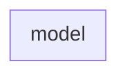

# このページで学べること

TensoFlow Recommenders の以下のページのExampleを通じてRecommendersの重要コンポーネントを理解する

https://www.tensorflow.org/recommenders/examples/basic_ranking

## はじめに

### TensorFlow Recommenders

TensorFlowで推薦システムを構築する際に使えるライブラリ

https://github.com/tensorflow/recommenders

:::note warn
最終リリース[v0.7.3](https://github.com/tensorflow/recommenders/releases/tag/v0.7.3)は2023/2/3で、1年半以上リリースされていないのでこのライブラリを使うかどうかは注意が必要
:::



### [tfrs.Model](https://github.com/tensorflow/recommenders/blob/5e0629cf10de22ef7ee38038cb1b22925ed822db/tensorflow_recommenders/models/base.py#L21)

`tf.keras.Model` を軽くWrapしたClass

>  Many recommender models are relatively complex, and do not neatly fit into
>  supervised or unsupervised paradigms. This base class makes it easy to
>  define custom training and test losses for such complex models.

シンプルに`compute_loss`を定義するだけで、内部的に`train_step`と`test_step`から`compute_loss`を呼び出して使ってくれるので、シンプルな推薦モデル作成に使えるクラス


使い方:
- `__init__`でモデルをセットする (Variable, task, loss, metricの初期化も)
- `compute_loss`でtraining lossを定義する
- (Optional) `call`で、 predictionでの計算を定義する


`tf.keras.Model` 内に定義されている`train_step`:

```py
  def train_step(self, inputs):
    """Custom train step using the `compute_loss` method."""

    with tf.GradientTape() as tape:
      loss = self.compute_loss(inputs, training=True)

      # Handle regularization losses as well.
      regularization_loss = tf.reduce_sum(
          [tf.reduce_sum(loss) for loss in self.losses]
      )

      total_loss = loss + regularization_loss

    gradients = tape.gradient(total_loss, self.trainable_variables)
    self.optimizer.apply_gradients(zip(gradients, self.trainable_variables))

    metrics = {metric.name: metric.result() for metric in self.metrics}
    metrics["loss"] = loss
    metrics["regularization_loss"] = regularization_loss
    metrics["total_loss"] = total_loss

    return metrics
```

`tf.keras.Model` 内に定義されている`test_step`:

```py
  def test_step(self, inputs):
    """Custom test step using the `compute_loss` method."""

    loss = self.compute_loss(inputs, training=False)

    # Handle regularization losses as well.
    regularization_loss = tf.reduce_sum(
        [tf.reduce_sum(loss) for loss in self.losses]
    )

    total_loss = loss + regularization_loss

    metrics = {metric.name: metric.result() for metric in self.metrics}
    metrics["loss"] = loss
    metrics["regularization_loss"] = regularization_loss
    metrics["total_loss"] = total_loss

    return metrics
```

詳細実装は[GitHub](https://github.com/tensorflow/recommenders/blob/5e0629cf10de22ef7ee38038cb1b22925ed822db/tensorflow_recommenders/models/base.py)

## [Ranking](https://www.tensorflow.org/recommenders/api_docs/python/tfrs/tasks/Ranking)

`tfrs.tasks.Ranking`というタスク

### 概要

Recommendationでは、Retrievalで大量の候補からある程度絞ってから、100〜1000ほどのItemをRankすることが一般的である。

今回は、このRankにFocusを絞ってみていく

Retrieval同様に tensorflow recommendersにあるタスクを使って実装する。rankingでは[tfrs.tasks.Ranking](https://www.tensorflow.org/recommenders/api_docs/python/tfrs/tasks/Ranking)というタスクを使う

### モデル

```py
class RankingModel(tf.keras.Model):

  def __init__(self):
    super().__init__()
    embedding_dimension = 32

    # Compute embeddings for users.
    self.user_embeddings = tf.keras.Sequential([
      tf.keras.layers.StringLookup(
        vocabulary=unique_user_ids, mask_token=None),
      tf.keras.layers.Embedding(len(unique_user_ids) + 1, embedding_dimension)
    ])

    # Compute embeddings for movies.
    self.movie_embeddings = tf.keras.Sequential([
      tf.keras.layers.StringLookup(
        vocabulary=unique_movie_titles, mask_token=None),
      tf.keras.layers.Embedding(len(unique_movie_titles) + 1, embedding_dimension)
    ])

    # Compute predictions.
    self.ratings = tf.keras.Sequential([
      # Learn multiple dense layers.
      tf.keras.layers.Dense(256, activation="relu"),
      tf.keras.layers.Dense(64, activation="relu"),
      # Make rating predictions in the final layer.
      tf.keras.layers.Dense(1)
  ])

  def call(self, inputs):

    user_id, movie_title = inputs

    user_embedding = self.user_embeddings(user_id)
    movie_embedding = self.movie_embeddings(movie_title)

    return self.ratings(tf.concat([user_embedding, movie_embedding], axis=1))
```

いくつかの特徴をあげておく

1. `tf.keras.Model` のModelを拡張して実装されている
1. `__init__`の中でuserとmovieのembeddingを計算し最後に Dense layerを3つで最後のlayerは1次元のlayerとなっている (regression)

## Loss and Metrics

上で定義したRankingModelモデルと `tfrs.tasks.Ranking` を使って最終的なModelを作成する。 lossにはMeanSquaredErrorを用いて、`compute_loss`関数を定義する。実際のuser_ratingと予測されたratingのMSEをlossとしている。

```py
class MovielensModel(tfrs.models.Model):

  def __init__(self):
    super().__init__()
    self.ranking_model: tf.keras.Model = RankingModel()
    self.task: tf.keras.layers.Layer = tfrs.tasks.Ranking(
      loss = tf.keras.losses.MeanSquaredError(),
      metrics=[tf.keras.metrics.RootMeanSquaredError()]
    )

  def call(self, features: Dict[str, tf.Tensor]) -> tf.Tensor:
    return self.ranking_model(
        (features["user_id"], features["movie_title"]))

  def compute_loss(self, features: Dict[Text, tf.Tensor], training=False) -> tf.Tensor:
    labels = features.pop("user_rating")

    rating_predictions = self(features)

    # The task computes the loss and the metrics.
    return self.task(labels=labels, predictions=rating_predictions)
```

## Train

```py
model = MovielensModel()
model.compile(optimizer=tf.keras.optimizers.Adagrad(learning_rate=0.1))
```

```
cached_train = train.shuffle(100_000).batch(8192).cache()
cached_test = test.batch(4096).cache()
```

```
model.fit(cached_train, epochs=3)
```

## Predict

```py
test_ratings = {}
test_movie_titles = ["M*A*S*H (1970)", "Dances with Wolves (1990)", "Speed (1994)"]
for movie_title in test_movie_titles:
  test_ratings[movie_title] = model({
      "user_id": np.array(["42"]),
      "movie_title": np.array([movie_title])
  })

print("Ratings:")
for title, score in sorted(test_ratings.items(), key=lambda x: x[1], reverse=True):
  print(f"{title}: {score}")
```

## Ref

Retrieval側はこちら

https://qiita.com/nakamasato/private/888bec663e7192705f35


<!--
https://chatgpt.com/c/66efffc9-bb60-8002-a134-650402b91923
-->

