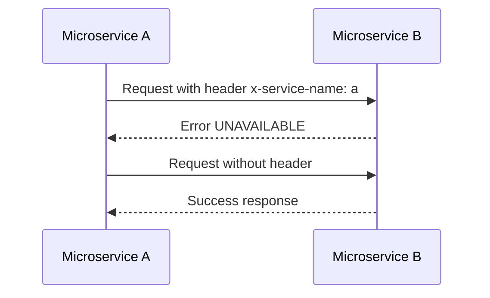

# Overview

Microserviceのtestをする際に依存サービスがUnavailableな状態でどのような挙動をするか確認する必要があるケースにはIstioのFault Injectionを使って、目的サービスの状態を決める事ができる。

今回は



# Prerequisite

- kind
- istioctl

# Step

## Preparation

### Kind

```
kind create cluster
```

### Istio

```
istioctl install --set profile=default -y
```

## Deploy microservice a, b, c


### service a

リクエストを送るだけのサービスなので `curl`でSleepさせているだけ

```
kubectl create ns ns-a
kubectl label namespace ns-a istio-injection=enabled
```

```
kubectl apply -f - <<EOF
apiVersion: apps/v1
kind: Deployment
metadata:
  name: microservice-a
  namespace: ns-a
spec:
  replicas: 1
  selector:
    matchLabels:
      app: microservice-a
  template:
    metadata:
      labels:
        app: microservice-a
    spec:
      containers:
      - name: microservice-a
        image: curlimages/curl:7.83.1
        command: [ "sh", "-c", "while true; do sleep 3600; done" ]
---
apiVersion: v1
kind: Service
metadata:
  name: microservice-a
  namespace: ns-a
spec:
  ports:
  - port: 80
    targetPort: 80
  selector:
    app: microservice-a
EOF
```

### service b

requestを受けるhttp-echoサービス

```
kubectl create ns ns-b
kubectl label namespace ns-b istio-injection=enabled
```

```
kubectl apply -f - <<EOF
apiVersion: apps/v1
kind: Deployment
metadata:
  name: microservice-b
  namespace: ns-b
spec:
  replicas: 1
  selector:
    matchLabels:
      app: microservice-b
  template:
    metadata:
      labels:
        app: microservice-b
    spec:
      containers:
      - name: microservice-b
        image: hashicorp/http-echo:0.2.3
        args:
        - "-text=Microservice B response"
        ports:
        - containerPort: 5678
---
apiVersion: v1
kind: Service
metadata:
  name: microservice-b
  namespace: ns-b
spec:
  ports:
  - port: 80
    targetPort: 5678
  selector:
    app: microservice-b
EOF
```


## VirtualService

`x-service-name: "a"` がヘッダーにあったら unavailableを返す virual serviceを作成

```
kubectl apply -f - <<EOF
# VirtualService for microservice B with fault injection for microservice A
apiVersion: networking.istio.io/v1beta1
kind: VirtualService
metadata:
  name: vs-b-fault-injection
  namespace: ns-a
spec:
  hosts:
  - microservice-b.ns-b.svc.cluster.local
  http:
  - match:
    - headers:
        x-service-name:
          exact: "a"
    fault:
      abort:
        percentage:
          value: 100
        # grpcStatus: UNAVAILABLE  # gRPCの場合
        httpStatus: 503  # HTTPの場合はこちらを使用
    route:
    - destination:
        host: microservice-b.ns-b.svc.cluster.local
        port:
          number: 80
  - route:
    - destination:
        host: microservice-b.ns-b.svc.cluster.local
        port:
          number: 80
EOF
```

## Check

```
A_POD=$(kubectl get pods -n ns-a -l app=microservice-a -o jsonpath="{.items[0].metadata.name}")
```

### With `-H "x-service-name: a"` -> 503 ❌️

a -> b

```
kubectl exec -n ns-a $A_POD -- curl -o /dev/null -w '%{http_code}\n' -s -H "x-service-name: a" microservice-b.ns-b.svc.cluster.local
```
503


### Without `-H "x-service-name: a"` -> 200 ✅️

a -> b

```
kubectl exec -n ns-a $A_POD -- curl -o /dev/null -w '%{http_code}\n' -s  microservice-b.ns-b.svc.cluster.local
```
200

# References

- https://istio.io/latest/docs/tasks/traffic-management/fault-injection/

