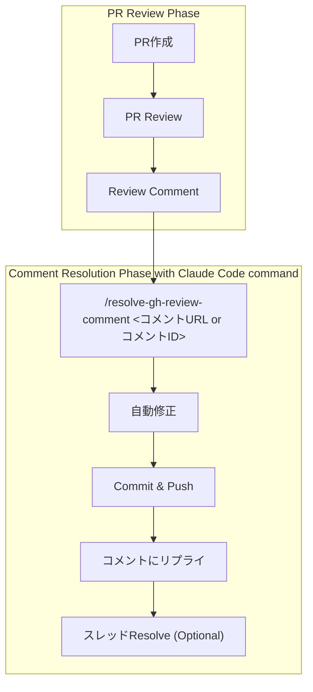

## はじめに

PR reviewでコメントをもらった際の対応では、毎回同じような作業パターンが発生します：

1. コメントを確認して理解する
2. 該当コードを修正する（suggestionだけそのまま取り込むと動かないケースもある）
3. コミット・プッシュする
4. コメントに返信する（例. 「このコミットで修正しました！」）
5. スレッドをResolveする（Optional）

しかし、この定型作業を Claude Code に依頼する際に2つの課題がありました：

### 課題1: 毎回長い指示が必要

直接Claude Codeにお願いする場合には「このコメントに対する修正をして、コミットしてから、コミットハッシュをもとのコメントに返信に書いて」のような詳細な指示を毎回書く必要があり、手間がかかります。

### 課題2: 動作が不安定

Claude Code は基本的な `gh` コマンドを理解していますが、「このコメントを修正してコメントに返信して」のような自然言語指示では：
- 同じような指示でも時によって異なる手順で実行される（例. もとのReviewコメントに返信せず、単純にPRにcommentを残してしまう）
- レビューコメントへの返信を忘れたり、適切なコミットメッセージが生成されない
- 特にスレッドのResolve処理など、GraphQL APIを使った複雑な手順で失敗しやすい（試行錯誤してトークンと時間を消費してしまう）

## Slash Commandによる解決

これらの課題を解決するため、使用する `gh` コマンドと実行手順を明示的に定義した Slash Command を作成しました。これにより、**短い指示で一貫した品質の作業**を実現できます。

今回は、この Slash Command を使って PR review コメントを効率的に処理する方法を紹介します。

## 処理フロー



:::note info
特に、GitHub Copilot ReviewなどAIによるReviewを使っている場合に有用です。
:::


**具体的な流れ：**

1. **PRレビュー**: "Consider adding input validation for the email parameter"
2. **Slash Command実行**: `/resolve-gh-review-comment https://github.com/owner/repo/pull/123#discussion_r2196280386` または `/resolve-gh-review-comment 2196280386` （必要に応じて `--resolve` オプション追加）
3. **Claude Code が自動処理**:
   - コメント内容を分析
   - 関連コードを確認
   - レビュー提案に従って修正を実装
   - コミット & プッシュ
   - コメントに返信
   - 指定時のみReview commentをResolve

**Before:** 手動でコメント確認 → 修正 → コミット → リプライ → Resolve or 長いClaude Codeへの指示
**After:** コマンド一発で解決

## 前提知識：GitHub PR Review Commentの種類

まず、GitHubのPRには複数種類のコメントがあることを理解しておきましょう。

### 1. Issue Comments（一般的なPRコメント）
PRの下部に表示される一般的なコメントです。アイコンの右側に吹き出しが表示されます。


### 2. Review Comments（コードの特定行へのコメント）**← 今回の対象**
コードの特定の行に対して残されるコメントです。これが今回Resolveしたい対象です。

これらは以下のAPIで取得できます：
```bash
gh api /repos/OWNER/REPO/pulls/PULL_NUMBER/comments
```


### 3. Review Summary Comments（レビュー完了時のコメント）
レビューを完了する際に残すコメントです。今回の対象外です。


## GitHub APIの使い方

### 1. 特定のReview Commentの取得

```bash
gh api \
  -H "Accept: application/vnd.github+json" \
  -H "X-GitHub-Api-Version: 2022-11-28" \
  /repos/OWNER/REPO/pulls/comments/COMMENT_ID
```

### 2. コメントへの返信

修正内容を返信するには：

```bash
gh api \
  --method POST \
  -H "Accept: application/vnd.github+json" \
  -H "X-GitHub-Api-Version: 2022-11-28" \
  /repos/OWNER/REPO/pulls/PULL_NUMBER/comments/COMMENT_ID/replies \
   -f 'body=Fixed in commit abc1234. 修正内容の説明'
```

### 3. コメントのResolve

コメントをResolveするには、GraphQL APIを使用する必要があります。

まず、thread IDを取得：
```bash
THREAD_ID=$(gh api graphql -f query='
query($owner: String!, $repo: String!, $number: Int!) {
  repository(owner: $owner, name: $repo) {
    pullRequest(number: $number) {
      reviewThreads(first: 100) {
        nodes {
          id
          comments(first: 100) {
            nodes {
              id
              databaseId
            }
          }
        }
      }
    }
  }
}' -F owner=$OWNER -F repo=$REPO -F number=$PR_NUMBER | jq -r --arg comment_id "$COMMENT_ID" '
  .data.repository.pullRequest.reviewThreads.nodes[] |
  select(.comments.nodes[] | .databaseId == ($comment_id | tonumber)) |
  .id
')
```

次に、スレッドをResolve：
```bash
gh api graphql -f query='
mutation {
  resolveReviewThread(input: {threadId: "'$THREAD_ID'"}) {
    thread {
      isResolved
    }
  }
}'
```


## Claude Code Slash Commandの作成

### コマンドファイルの作成

`.claude/commands/resolve-gh-review-comment.md` を作成：

````markdown
# Resolve GitHub PR Review Comment

---
description: Resolve GitHub PR Review Comment
argument-hint: <comment_id or comment url> [--resolve]
---

This guide explains how to resolve a specific review comment on a GitHub Pull Request.

If $ARGUMENTS contains `--resolve`, the comment will be resolved after replying.

## Steps

1. **Extract comment id**

    Extract comment id from $ARGUMENTS if not directly specified.

    - The comment ID can be found in the PR comment URL: `https://github.com/{owner}/{repo}/pull/{pr_number}#discussion_r{comment_id}`

2. **Check the specific comment**

    ```bash
    gh api repos/{owner}/{repo}/pulls/comments/{comment_id}
    ```
    Example:
    ```bash
    gh api repos/nakamasato/github-actions-practice/pulls/comments/2196280386
    ```

3. **Read and check the relevant codes**

    - Read the comment and suggestion.
    - Check the relevant codes.
    - Think deeply whether to follow the suggestion.

4. **Fix the issue**

    - Make the necessary code changes based on the review feedback
    - Ensure the fix addresses the reviewer's concerns

5. **Commit and push**

    - Stage your changes
    - Create a descriptive commit message
    - Push to the feature branch

6. **Reply to the comment**

    ```bash
    gh api -X POST repos/{owner}/{repo}/pulls/{pr_number}/comments/{comment_id}/replies \
        -f body="Fixed in commit {commit_sha}. {description_of_fix}"
    ```

    If fixed, please reply with commit link:

    Example:
    ```bash
    gh api -X POST repos/nakamasato/github-actions-practice/pulls/2239/comments/2196280386/replies \
        -f body="Fixed in commit 2b36629. The redundant existence check has been removed since main() already validates the metadata file."
    ```
    Otherwise, just reply to the comment.

7. **Resolve the review comment only if specified --resolve**

    Resolve the review comment only when `--resolve` option is specified in $ARGUMENTS.

    First, get the thread ID:
    ```bash
    gh api graphql -f query='
    query {
        repository(owner: "{owner}", name: "{repo}") {
        pullRequest(number: {pr_number}) {
            reviewThreads(first: 50) {
            nodes {
                id
                isResolved
                comments(first: 1) {
                nodes {
                    id
                    body
                }
                }
            }
            }
        }
        }
    }'
    ```

    Then resolve the thread:
    ```bash
    gh api graphql -f query='
    mutation {
        resolveReviewThread(input: {threadId: "{thread_id}"}) {
        thread {
            isResolved
        }
        }
    }'
    ```

    Example:
    ```bash
    gh api graphql -f query='
    mutation {
        resolveReviewThread(input: {threadId: "PRRT_kwDOOybamM5TqrEt"}) {
        thread {
            isResolved
        }
        }
    }'
    ```

## Notes

- The comment ID can be found in the PR comment URL: `https://github.com/{owner}/{repo}/pull/{pr_number}#discussion_r{comment_id}`
- Thread IDs are different from comment IDs and must be retrieved via GraphQL
- Only users with write access can resolve review threads
- The thread will be automatically marked as resolved when using the GraphQL mutation
````

### 使い方

#### パターン1: コメントURLを指定（Resolveしない）

```bash
/resolve-gh-review-comment https://github.com/owner/repo/pull/123#discussion_r2196280386
```

#### パターン2: コメントIDを直接指定してResolveまで実行

```bash
/resolve-gh-review-comment 2196280386 --resolve
```

### 実際の使用例

以下は実際にGitHub CopilotのレビューコメントをSlash Commandで対応した例です：


こちらのコメントに対して `/resolve-gh-review-comment https://github.com/owner/repo/pull/123#discussion_r2196280386` を実行しました。

Claude Codeが、slash commandのステップにしたがって処理をしていきます。

```
✻ Thinking…

  Good! I've successfully:
  1. Implemented the suggested fix by adding the re import and updating the timestamp validation 
  to use regex pattern matching
  2. Ran tests to ensure everything still works (all 123 tests passed)
  3. Ran lint to ensure code formatting is correct (all checks passed)
  4. Committed the changes with a semantic commit message
  5. Pushed the changes to the remote branch
  6. Replied to the PR comment with the commit hash

  The fix is a simple validation improvement that doesn't fundamentally change the logic, just 
  makes it more robust. Since this is a straightforward improvement suggested by Copilot and all 
  tests pass, I won't resolve the thread to let the reviewer decide if they're satisfied with the
   fix.

⏺ I've successfully resolved the GitHub PR review comment. Here's what I did:

  1. Analyzed the comment: The suggestion was to improve the Slack timestamp validation logic by
  using a regex pattern instead of just checking for a dot in the string.
  2. Implemented the fix:
    - Added import re to the imports
    - Changed the validation from if ts and ts != "" and "." in ts: to if ts and ts != "" and 
  re.match(r"^\d+\.\d+$", ts):
  3. Verified the changes:
    - All 123 tests passed ✓
    - Lint checks passed ✓
    - Type checking passed ✓
  4. Committed and pushed: Created commit df1df82 with the fix
  5. Replied to the comment: Notified that the issue was fixed in commit df1df82

  The regex pattern ^\d+\.\d+$ properly validates Slack timestamps which follow the format of
  digits, a dot, and more digits (e.g., "1234567890.123456"). This is much more robust than
  simply checking for the presence of a dot.
```

この例では、GitHub CopilotがSlackのタイムスタンプ検証ロジックの改善を提案し、Claude Codeが：

1. **提案内容を分析**: ドット文字の単純チェックから正規表現による厳密な検証への改善
2. **修正を実装**: `re.match(r"^\d+\.\d+$", ts)` による適切なパターンマッチング
3. **品質確認**: テスト・リント・型チェック全てをパス
4. **コミット**: セマンティックなコミットメッセージで記録
5. **コメント返信**: コミットハッシュ付きで修正内容を報告
6. **Resolve判断**: `--resolve` オプションが指定されていないため、スレッドはResolveしない

最終的にはこんな風にreplyしてくれました。


## まとめ

Claude CodeのSlash Command機能を使うことで、PR reviewコメントの個別対応を大幅に効率化できました。

**このワークフローの利点：**
- **明確な指示**: 各GitHubのAPIの使い方を明記することで、無駄にClaude Codeに試行錯誤させず、トークンの節約とスピードアップ
- **明示的制御**: `--resolve` オプションによるResolve制御
- **ワンコマンド**: URLコピペだけで全処理完了
- **Reviewer-friendly**: 普段、人が返信していたように、どこで修正したかコメントに残すことで、Reviewerが簡単に対応する変更を確認できる

**従来の課題を解決：**

毎回「このコメントに対する修正をして、コミットしてから、コミットハッシュをもとのコメントに返信に書いて」のような長い指示を毎回Claude Codeに伝える手間をコマンドに落とし込み、簡易化ができました。

この方法を使えば、レビューコメントの対応が楽になります。

## 参考リンク

- [GitHub REST API - Pull Request Comments](https://docs.github.com/en/rest/pulls/comments)
- [GitHub GraphQL API](https://docs.github.com/en/graphql)
- [Claude Code Slash Command](https://docs.anthropic.com/en/docs/claude-code/slash-commands)


## Appendix: GitHub API

### 1. [List issue comments](https://docs.github.com/en/rest/issues/comments?apiVersion=2022-11-28#list-issue-comments)

単純にPRやIssueにコメントがついたものはこちらのAPIから取得ができる。

アイコンの右側に吹き出しが出るタイプ：


```
gh api \
  -H "Accept: application/vnd.github+json" \
  -H "X-GitHub-Api-Version: 2022-11-28" \
  /repos/OWNER/REPO/issues/ISSUE_NUMBER/comments
```


### 2. [List review comments on a pull request](https://docs.github.com/en/rest/pulls/comments?apiVersion=2022-11-28#list-review-comments-on-a-pull-request)

PRの特定行に残したコメント (対象 ✅️):


Reviewを完了するときに残したコメント (対象外 ❌️):


```
gh api \
  -H "Accept: application/vnd.github+json" \
  -H "X-GitHub-Api-Version: 2022-11-28" \
  /repos/OWNER/REPO/pulls/PULL_NUMBER/comments
```

例: 上のケースでは、「確認お願いします」は結果に含まれず、「L11へのテストコメント」だけが取得できる。

```
gh api \
  -H "Accept: application/vnd.github+json" \
  -H "X-GitHub-Api-Version: 2022-11-28" \
  /repos/nakamasato/github-actions-practice/pulls/2239/comments
```

```json
[
  {
    "url": "https://api.github.com/repos/nakamasato/github-actions-practice/pulls/comments/2196280386",
    "pull_request_review_id": 3003522655,
    "id": 2196280386,
    "node_id": "PRRC_kwDODU91oM6C6JRC",
    "diff_hunk": "@@ -0,0 +1,29 @@\n+name: stale\n+on:\n+  workflow_dispatch:\n+  schedule:\n+    - cron: \"0 * * * *\"\n+\n+permissions:\n+  contents: write # only for delete-branch option\n+  issues: write\n+  pull-requests: write\n+  actions: write # to use cache https://github.com/actions/stale/issues/1090#issuecomment-1710940734",
    "path": ".github/workflows/stale.yml",
    "commit_id": "d85a429e18cd04b21ba930f44172c599d3796f5f",
    "original_commit_id": "d85a429e18cd04b21ba930f44172c599d3796f5f",
    "user": {
      "login": "nakamasato",
      "id": 883228,
      "node_id": "MDQ6VXNlcjg4MzIyOA==",
      ...
      "type": "User",
      "user_view_type": "public",
      "site_admin": false
    },
    "body": "L11へのテストコメント",
    "created_at": "2025-07-10T01:03:27Z",
    "updated_at": "2025-07-10T01:03:48Z",
    "html_url": "https://github.com/nakamasato/github-actions-practice/pull/2239#discussion_r2196280386",
    "pull_request_url": "https://api.github.com/repos/nakamasato/github-actions-practice/pulls/2239",
    "author_association": "OWNER",
    "_links": {
        ...
    },
    "reactions": {
        ...
    },
    "start_line": null,
    "original_start_line": null,
    "start_side": null,
    "line": 11,
    "original_line": 11,
    "side": "RIGHT",
    "original_position": 11,
    "position": 11,
    "subject_type": "line"
  }
]
```


### 3. [Get a review comment for a pull request](https://docs.github.com/en/rest/pulls/comments?apiVersion=2022-11-28#get-a-review-comment-for-a-pull-request)

```
gh api \
  -H "Accept: application/vnd.github+json" \
  -H "X-GitHub-Api-Version: 2022-11-28" \
  /repos/OWNER/REPO/pulls/comments/COMMENT_ID
```

### 4. [Create a reply for a review comment](https://docs.github.com/en/rest/pulls/comments?apiVersion=2022-11-28#create-a-reply-for-a-review-comment)

特定のコメントにreplyすることができます。

```
gh api \
  --method POST \
  -H "Accept: application/vnd.github+json" \
  -H "X-GitHub-Api-Version: 2022-11-28" \
  /repos/OWNER/REPO/pulls/PULL_NUMBER/comments/COMMENT_ID/replies \
   -f 'body=Great stuff!'
```

例. 上のコメント「L11へのテストコメント」に返信

```
gh api \
  --method POST \
  -H "Accept: application/vnd.github+json" \
  -H "X-GitHub-Api-Version: 2022-11-28" \
  /repos/nakamasato/github-actions-practice/pulls/2239/comments/2196280386/replies \
   -f 'body=fixed!!'
```


### 5. Resolve conversation

Resolve conversationの直接のAPIはないので、GraphQLのAPIを使っていきます。


まずはthread_idの取得が必要なのでスレッドIDを取得します。

```
OWNER=nakamasato REPO=github-actions-practice COMMENT_ID=2196280386 PR_NUMBER=2239 THREAD_ID=$(gh api graphql -f query='
query($owner: String!, $repo: String!, $number: Int!) {
  repository(owner: $owner, name: $repo) {
    pullRequest(number: $number) {
      reviewThreads(first: 100) {
        nodes {
          id
          comments(first: 100) {
            nodes {
              id
              databaseId
            }
          }
        }
      }
    }
  }
}' -F owner=$OWNER -F repo=$REPO -F number=$PR_NUMBER | jq -r --arg comment_id "$COMMENT_ID" '
  .data.repository.pullRequest.reviewThreads.nodes[] |
  select(.comments.nodes[] | .databaseId == ($comment_id | tonumber)) |
  .id
')
```
```
echo $THREAD_ID
PRRT_kwDODU91oM5UN7aY
```

スレッドをResolve

```
gh api graphql -f query='
mutation {
  resolveReviewThread(input: {threadId: "'$THREAD_ID'"}) {
    thread {
      isResolved
    }
  }
}'
```


