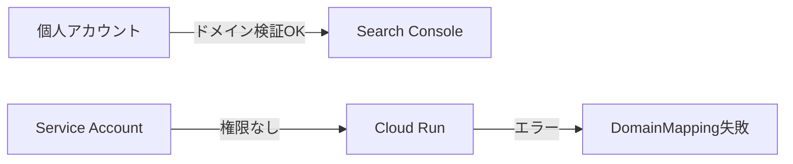

## はじめに

Cloud Run で Custom Domain を設定する際、Terraform や gcloud コマンドで以下のようなエラーに遭遇することがあります。

```
Error: Error waiting to create DomainMapping: resource is in failed state "Ready:False", 
message: Caller is not authorized to administer the domain example.com. 
If you own example.com, you can obtain authorization by verifying ownership of the domain, 
or any of its parent domains, via the Webmaster Central portal: 
https://www.google.com/webmasters/verification/verification?domain=
```

このエラーは特に **CI/CD パイプライン** や **Service Account を使用した自動デプロイ** で発生しやすく、解決方法が分かりにくいため、本記事で詳しく解説します。

## TL;DR

**Service Account にドメインの所有者権限を付与する必要があります。**

1. Google Search Console でドメインを検証
2. Service Account のメールアドレスを「所有者」として追加
3. Terraform/gcloud を再実行

## エラーの原因

このエラーは以下の状況で発生します：

### 1. 個人アカウントでドメイン検証済み、Service Account で実行



### 2. GitHub Actions などの CI/CD での自動デプロイ

```yaml
# .github/workflows/deploy.yml
- name: Deploy to Cloud Run
  run: terraform apply -auto-approve
  # ↑ Service Account で実行されるためエラー
```

### 3. 複数のプロジェクトや環境での展開

- 開発環境: 個人アカウントで設定 ✅
- 本番環境: Service Account で設定 ❌

## 解決方法

### Step 1: ドメインの所有権を確認

まず、個人の Google アカウントでドメインの所有権を確認します。

1. [Google Search Console](https://search.google.com/search-console) にアクセス
2. 「プロパティを追加」→「ドメイン」を選択
3. ドメイン名（例: `example.com`）を入力
4. TXT レコードを DNS に追加
5. 検証を完了

### Step 2: Service Account のメールアドレスを確認

```bash
# Terraform で使用している Service Account を確認
gcloud config get-value account

# プロジェクトの Service Account 一覧
gcloud iam service-accounts list

# 出力例:
# NAME                                    EMAIL
# terraform-sa                            terraform-sa@my-project.iam.gserviceaccount.com
# github-actions                          github-actions@my-project.iam.gserviceaccount.com
```

### Step 3: Service Account を所有者として追加

**重要: これが最も見落としやすいステップです**

1. [Google Search Console](https://search.google.com/search-console) を開く
2. 検証済みのドメインプロパティを選択
3. 左メニューの「設定」をクリック
4. 「ユーザーと権限」をクリック
5. 「ユーザーを追加」ボタンをクリック
6. Service Account のメールアドレスを入力
   ```
   例: terraform-sa@my-project.iam.gserviceaccount.com
   ```
7. 権限を「**オーナー**」に設定（重要！）
8. 「追加」をクリック

### Step 4: 権限の確認と再実行

権限追加後、すぐに反映されます。

```bash
# Terraform の場合
terraform plan
terraform apply

# gcloud の場合
gcloud run domain-mappings create \
  --service=my-service \
  --domain=example.com \
  --region=asia-northeast1
```

## Terraform 設定例

```hcl
resource "google_cloud_run_domain_mapping" "default" {
  location = var.region
  name     = var.custom_domain

  metadata {
    namespace = var.project_id
  }

  spec {
    route_name = google_cloud_run_service.default.name
  }
  
  # エラーが発生した場合の対処
  depends_on = [
    google_cloud_run_service.default
  ]
}
```

## トラブルシューティング

### 1. 権限追加後もエラーが続く場合

```bash
# Service Account が正しいか確認
gcloud auth list

# 現在のアカウントで実行
gcloud run domain-mappings create \
  --service=my-service \
  --domain=example.com \
  --region=asia-northeast1 \
  --impersonate-service-account=SERVICE_ACCOUNT_EMAIL
```

### 2. サブドメインを使用する場合

親ドメインで検証すると一回ですむ：

- `example.com` を検証 -> `subdomain.example.com` を使える
- `example.com` を検証 -> `api.example.com` を使える

サブドメインを個別に検証することも可能

### 3. 複数プロジェクトで同じドメインを使用

各プロジェクトの Service Account を Search Console で所有者として追加する必要があります。

```bash
# プロジェクトA の Service Account
sa-project-a@project-a.iam.gserviceaccount.com

# プロジェクトB の Service Account  
sa-project-b@project-b.iam.gserviceaccount.com

# 両方を Search Console で所有者として追加
```

## まとめ

「Error waiting to create DomainMapping」エラーは、Service Account にドメイン所有者権限がないことが原因です。

重要なポイント：

1. **ドメイン検証は個人アカウント単位** - 他のユーザーや Service Account には自動的に共有されない
2. **Search Console での権限付与が必要** - IAM の権限とは別
3. **権限は「オーナー」レベルが必要** - 「フルアクセス」では不十分
4. **親ドメインで検証すると楽** - サブドメインすべてに適用される

## 参考リンク

- [Cloud Run - Add verified domain owners to other users or service accounts](https://cloud.google.com/run/docs/mapping-custom-domains#add-verified)
- [Google Search Console](https://search.google.com/search-console)
- [Cloud Run のカスタムドメインのトラブルシューティング](https://cloud.google.com/run/docs/troubleshooting?hl=ja#custom-domains)

