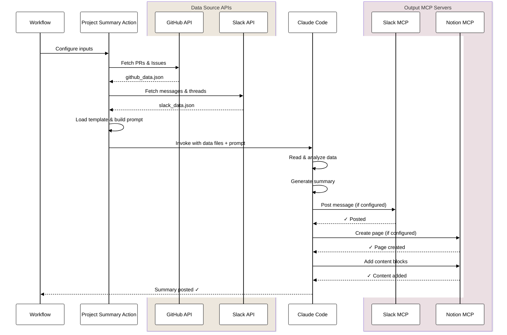

## はじめに

以前、[Claude Code GitHub Actions + Slack MCPで毎月のGitHub 活動サマリーをSlackに投稿する](https://qiita.com/nakamasato/items/9d61b3d84cee09c3a822)を紹介しました。今回は、その進化版として**Slackのデータソース追加**、**柔軟な期間指定**、**カスタマイズ可能なプロンプト**、そして**Notion連携**を実装した新バージョンをご紹介します！

これにより、GitHubのコード変更だけでなく、Slackでのディスカッション内容も含めた包括的なチームアクティビティレポートを自動生成し、Notionデータベースに永続的に保存できるようになりました。

## アーキテクチャ概要


このシステムは5つのフェーズで動作します：

1. **📥 Input Phase**: GitHub リポジトリ、Slack チャンネル、期間、テンプレートを指定
2. **🔄 Data Collection Phase**: GitHub APIとSlack APIからデータを収集し、JSON形式で保存
3. **📝 Prompt Generation Phase**: テンプレートとカスタマイズ設定を組み合わせてプロンプトを生成
4. **🤖 LLM Processing Phase**: Claude Codeがデータを分析し、レポートを生成
5. **📤 Output Phase**: MCPサーバー経由でSlackとNotionに出力

## 解決する課題

前回のバージョンでは以下の課題がありました：

1. **GitHubの情報のみ**: Slackでの重要な議論や決定事項が含まれない
2. **固定的な期間指定**: 月次レポートのみで、スプリントや四半期などの柔軟な期間設定ができない
3. **レポートの保存先**: Slack通知のみで、長期的なドキュメント管理が困難
4. **プロンプトの硬直性**: ユースケースに応じたカスタマイズが難しい

これらすべてを解決する新機能を実装しました！

## 新機能の概要

### 1. **マルチデータソース対応**
- GitHub（PRs、Issues、Commits）
- Slack（チャンネルメッセージ、スレッド）

### 2. **柔軟な期間指定**
- `last-7-days`: 直近7日間
- `last-month`: 前月
- `last-quarter`: 前四半期  
- `YYYY-MM`: 特定の月
- `YYYY-MM-DD..YYYY-MM-DD`: カスタム期間

### 3. **プロンプトテンプレート**
- `monthly-report`: 月次開発レポート
- `sprint-summary`: スプリントサマリー
- `release-notes`: リリースノート
- `weekly-check`: 週次チェック

### 4. **出力先の拡張**
- Slack通知（従来通り）
- Notionデータベースへの自動保存（NEW!）

## 仕組み

### MCP (Model Context Protocol) サーバーの活用

この実装の要となるのが、**MCP サーバー**を使ったClaude Codeとの連携です。MCPサーバーは、LLMが外部サービスと安全にやり取りするためのプロトコルで、以下のような特徴があります：

- **Slack MCP Server**: Slackのメッセージ取得と投稿を担当
- **Notion MCP Server**: Notionのページ作成とコンテンツ更新を担当

```yaml
# MCP設定例 (claude_mcp_config.json)
{
  "mcpServers": {
    "slack": {
      "command": "npx",
      "args": ["-y", "@modelcontextprotocol/server-slack"],
      "env": { "SLACK_BOT_TOKEN": "$SLACK_TOKEN" }
    },
    "notion": {
      "command": "npx",
      "args": ["-y", "@notionhq/notion-mcp-server"],
      "env": { "NOTION_TOKEN": "$NOTION_TOKEN" }
    }
  }
}
```

### データフロー



1. **データ収集**: GitHub CLIとSlack APIを使用してローデータを収集
2. **データ構造化**: JSON形式で統一的に構造化
3. **AI処理**: Claude Codeがデータを読み込み、テンプレートに基づいて分析
4. **出力生成**: MCPサーバー経由で各サービスに直接出力

## セットアップ

### 必要な準備

1. **GitHub Token**: リポジトリへのアクセス権限
2. **Slack App**: 
   - OAuth Token（`xoxb-`で始まる）
   - チャンネル読み書き権限（`channels:history`, `channels:read`, `chat:write`）
3. **Notion Integration**:
   - Integration Token
   - Database ID <- 事前にNotion Databaseを作成しておく必要があります
4. **Anthropic API Key**: Claude APIアクセス用

### GitHub Secretsの設定

```yaml
# 必須
ANTHROPIC_API_KEY
SLACK_BOT_TOKEN      # Slack連携する場合
SLACK_TEAM_ID        # Slack連携する場合
NOTION_TOKEN         # Notion連携する場合
NOTION_DATABASE_ID   # Notion連携する場合
```

## 使い方

### 基本的な使い方

```yaml
name: Team Activity Report

on:
  schedule:
    - cron: '0 0 1 * *'  # 毎月1日
  workflow_dispatch:
    inputs:
      period:
        description: 'Report period'
        required: false
        default: 'last-month'
        type: choice
        options:
          - last-7-days
          - last-month
          - last-quarter

jobs:
  generate-report:
    runs-on: ubuntu-latest
    steps:
      - uses: actions/checkout@v4
      
      - name: Generate Team Report
        uses: nakamasato/claude-code-actions/project-summary@v1
        with:
          # データソース設定
          github_repositories: ${{ github.repository }}
          slack_channels: 'C1234567890,C0987654321'
          
          # 出力設定
          outputs: 'slack,notion'  # 出力先を明示的に指定
          notification_slack_channel: 'C1234567890'  # Slack通知先チャンネルID
          notion_database_id: ${{ secrets.NOTION_DATABASE_ID }}
          notion_title_format: "月次レポート (YYYY-MM)"
          
          # 期間とテンプレート
          period: ${{ inputs.period || 'last-month' }}
          template: 'monthly-report'
          language: 'ja'
          
          # 認証トークン
          github_token: ${{ secrets.GITHUB_TOKEN }}
          slack_bot_token: ${{ secrets.SLACK_BOT_TOKEN }}
          slack_team_id: ${{ secrets.SLACK_TEAM_ID }}
          notion_token: ${{ secrets.NOTION_TOKEN }}
          anthropic_api_key: ${{ secrets.ANTHROPIC_API_KEY }}
```

### 高度なカスタマイズ例

#### スプリント振り返り（2週間ごと）

```yaml
name: Sprint Retrospective

on:
  schedule:
    - cron: '0 10 * * 1'  # 毎週月曜日（隔週判定は別途実装）

jobs:
  sprint-retro:
    runs-on: ubuntu-latest
    steps:
      - uses: nakamasato/claude-code-actions/project-summary@v1
        with:
          # データソース
          github_repositories: ${{ github.repository }}
          slack_channels: 'C1234567890'  # スプリントチャンネル
          
          # 出力設定
          outputs: 'slack,notion'
          notification_slack_channel: 'C1234567890'
          notion_database_id: ${{ secrets.NOTION_DATABASE_ID }}
          
          # 期間とテンプレート
          period: 'last-14-days'
          template: 'sprint-summary'
          
          # カスタムプロンプト
          system_prompt: |
            スプリントの振り返りレポートを作成してください。
            以下の観点を必ず含めてください：
            - 完了したストーリーポイント
            - ベロシティの変化
            - ブロッカーとその解決状況
            - チームの改善提案
          
          slack_output_format: |
            ## 🏃 スプリント {sprint_number} 振り返り
            ### 📊 メトリクス
            {metrics}
            ### ✅ 完了タスク
            {completed_tasks}
            ### 🚧 課題と改善点
            {improvements}
            
          notion_output_format: |
            # スプリント振り返り
            **期間**: {period}
            ## サマリー
            {summary}
            ## 詳細分析
            {detailed_analysis}
```

:::note info
`system_prompt`, `slack_output_format`, `notion_output_format` を直接指定することで、選択したテンプレートの対応する設定をCustomizeすることができます。
一部だけCustomizeすることも可能なので、出力フォーマットだけを自分の指定のものに変更することもできます。
:::


#### リリースノート自動生成

```yaml
name: Release Notes Generation

on:
  push:
    tags:
      - 'v*'

jobs:
  release-notes:
    runs-on: ubuntu-latest
    steps:
      - uses: nakamasato/claude-code-actions/project-summary@v1
        with:
          # データソース
          github_repositories: ${{ github.repository }}
          
          # 出力設定
          outputs: 'slack,notion'
          notification_slack_channel: 'release-announcements'
          notion_database_id: ${{ secrets.NOTION_DATABASE_ID }}
          notion_title_format: "Release ${{ github.ref_name }}"
          
          # 期間とテンプレート
          period: ${{ github.event.before }}...${{ github.sha }}
          template: 'release-notes'
          language: 'en'
          
          # 認証トークン
          github_token: ${{ secrets.GITHUB_TOKEN }}
          slack_bot_token: ${{ secrets.SLACK_BOT_TOKEN }}
          slack_team_id: ${{ secrets.SLACK_TEAM_ID }}
          notion_token: ${{ secrets.NOTION_TOKEN }}
          anthropic_api_key: ${{ secrets.ANTHROPIC_API_KEY }}
          
          # GitHub Releaseにも出力
          create_github_release: true
```

## Output例

:::note info
こちらに載せたのは個人プロジェクトの例なのでSlackでの議論なく、機械的なレポートですが、活発なプロジェクトだとかなりボリュームのあるレポートが生成されます。
:::


### Slackメッセージ


### Notionページ


## プロンプトテンプレートの詳細

### monthly-report（月次レポート）
- GitHub: PR、Issue、コミットの統計
- Slack: 重要な議論、決定事項
- 出力: チーム活動の包括的なサマリー

### sprint-summary（スプリントサマリー）
- 完了タスクとストーリーポイント
- ベロシティとバーンダウン
- ブロッカーと改善提案

### release-notes（リリースノート）
- 新機能と改善点
- バグ修正
- Breaking changes
- マイグレーションガイド

### weekly-check（週次チェック）
- 今週の進捗
- 来週の予定
- ブロッカーと依存関係

## 活用例

### 1. 月次経営レポート
経営層向けに、開発の進捗とチームのパフォーマンスを可視化：

```yaml
period: 'last-month'
template: 'monthly-report'
outputs: 'slack,notion'
system_prompt: |
  経営層向けのエグゼクティブサマリーを作成してください。
  KPIの達成状況、リスク、次月の重点項目を含めてください。
```

### 2. プロジェクト横断レポート
複数リポジトリ・複数Slackチャンネルを統合：

```yaml
github_repositories: 'org/frontend,org/backend,org/mobile'
slack_channels: 'C123,C456,C789'  # dev, design, product
outputs: 'slack,notion'
```

### 3. 顧客向けリリースレポート
外部公開用のリリース情報を自動生成：

```yaml
template: 'release-notes'
outputs: 'notion'  # Notionのみに出力
system_prompt: |
  顧客向けのリリースノートを作成してください。
  技術的な詳細は省き、ビジネス価値を強調してください。
language: 'ja'
```

## 効果測定

導入して間もないので、週次レポートと月次レポートをそれぞれ生成して調整していこうとおもっています。

## 今後の改善

- **コンテキストエンジニアリング**: メンバーが多くアクティブなプロジェクトだと期間によってはコンテキストが溢れてしまい、処理しきれない可能性があるので、何段階かにわけて重要な情報を抽出可能に
- **Notionプロパティの拡張**: カスタムプロパティ（Type、Period、Statusなど）の自動設定機能
- **テンプレートの追加**: デイリースタンドアップ、四半期レビューなど

## まとめ

Claude Code ActionsのとNotion, Slack, GitHubをMCPやAPIで連携することで、チーム活動の自動レポート生成がパワーアップしました。GitHubとSlackのデータを統合し、Notionで永続的に管理することで、チームの活動を包括的に可視化・記録できます。

興味がある方は使ってみてください。

## リンク

- [GitHubリポジトリ](https://github.com/nakamasato/claude-code-actions/blob/main/project-summary/README.md)
- [前回の記事](https://qiita.com/nakamasato/items/9d61b3d84cee09c3a822)

