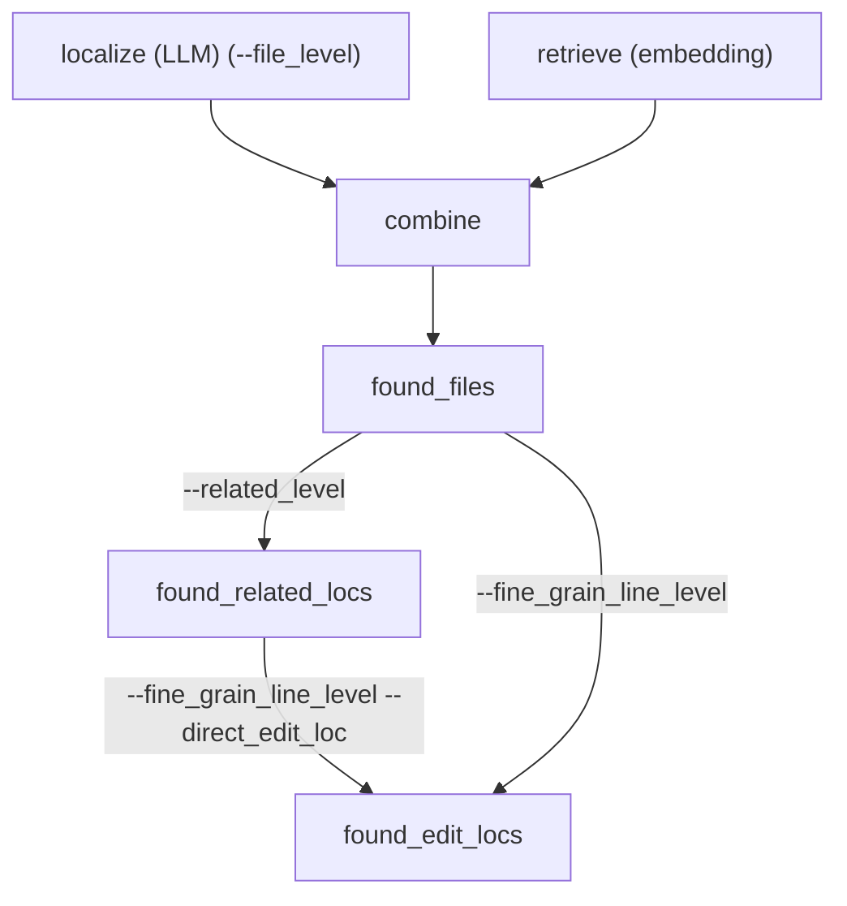

## 始めに

前回 [Agentlessを試す](https://qiita.com/nakamasato/items/9ac2f45502e869ac078e)で実行する方法を紹介しました。

今回は、その中身に関して見ていきたいと思います。



## 1. `python agentless/fl/localize.py`

argsの引数がたくさんありますが、呼ばれる関数は以下の3種類

- [merge](https://github.com/OpenAutoCoder/Agentless/blob/5ce5888b9f149beaace393957a55ea8ee46c9f71/agentless/fl/localize.py#L469): `--merge`で呼ばれる
- [localize_irrelevant](https://github.com/OpenAutoCoder/Agentless/blob/5ce5888b9f149beaace393957a55ea8ee46c9f71/agentless/fl/localize.py#L398): `--irrelevant` で呼ばれる
- [localize](https://github.com/OpenAutoCoder/Agentless/blob/5ce5888b9f149beaace393957a55ea8ee46c9f71/agentless/fl/localize.py#L432): Defaultでこれが呼ばれる

### 1.1. localize

:::note info
swe benchの問題に対してlocalizeする関数
:::

1. swe_bench_data を取得
1. 問題ごとに `localize_instance`を実行する

### 1.2. localize_instance

:::note info
問題 (instance_idは `django__django-10914` このようなissueに割り振られているid) ごとにlocalizeする関数
:::

1. args.target_idが指定されている場合には、対象のinstance_idと異なる場合には何もせずreturn
1. existing_instance_ids の中に対象のinstance_idが含まれていればSkip
1. `get_repo_structure`を実行してstructureを取得する (structureは、レポないのすべてのファイルと関数と行数などが記載されており数十MBにも登る大きいデータ)
1. `filter_none_python(structure)` でpython以外のファイルをフィルター
1. `filter_out_test_files(structure)`でtestのファイルをフィルター
1. 実行の種類によってロジックが異なる（以下で分けて説明）

実行の種類:

1. file_level
1. related_level
1. fine_grain_line_level

最終的にファイルに保存される内容:

```py
{
    "instance_id": instance_id,
    "found_files": found_files,  # file_level
    "additional_artifact_loc_file": additional_artifact_loc_file,  # file_level
    "file_traj": file_traj,  # file_level
    "found_related_locs": found_related_locs,  # related_level
    "additional_artifact_loc_related": additional_artifact_loc_related,  # related_level
    "related_loc_traj": related_loc_trajs,  # related_level
    "found_edit_locs": found_edit_locs,  # fine_grain_line_level
    "additional_artifact_loc_edit_location": additional_artifact_loc_edit_location,  # fine_grain_line_level
    "edit_loc_traj": edit_loc_traj,  # fine_grain_line_level
}
```

1. `instance_id`: task ID of the issue (e.g. `django__django-10914`)
1. `--file_level`時に取得されるFields
    1. `found_files`: list of files localized by the model
        e.g. 
        ```json
        [
            "django/core/files/storage.py", 
            "django/conf/global_settings.py", 
            "django/core/files/uploadhandler.py", 
            "django/core/files/uploadedfile.py", 
            "docs/conf.py"
        ]
        ```
    1. `additional_artifact_loc_file`: raw output of the model during file-level localization
        e.g. 
        ```json
        {
            "raw_output_files": "```\ndjango/core/files/storage.py\ndjango/conf/global_settings.py\ndjango/core/files/uploadhandler.py\ndjango/core/files/uploadedfile.py\ndocs/conf.py\n```"
        }
        ```
    1. `file_traj`: trajectory of the model during file-level localization (e.g. `response`, `usage`, `prompt`)
1. `--related_level`時に取得されるFields
    1. `found_related_locs`: dict of relevant code elements localized by the model
        ```json
        {
            "django/core/files/storage.py": ["class: FileSystemStorage"],
            "django/conf/global_settings.py": ["variable: FILE_UPLOAD_PERMISSIONS"],
            "django/core/files/uploadhandler.py": [""]
        }
        ```
    1. `additional_artifact_loc_related`: raw output of the model during relevant-code-level localization
    1. `related_loc_traj`: trajectory of the model during relevant-code-level localization
1. `--fine_grain_line_level`時に取得されるFields
    1. `found_edit_locs`: dict of edit locations localized by the model
        ```json
        [
            {
                "django/core/files/storage.py": ["line: 260\nline: 217"], 
                "django/conf/global_settings.py": ["line: 307"], 
                "django/core/files/uploadhandler.py": [""]
            }, 
            {
                "django/core/files/storage.py": [""], 
                "django/conf/global_settings.py": [""], 
                "django/core/files/uploadhandler.py": [""]
            }, {
                "django/core/files/storage.py": ["line: 260"], 
                "django/conf/global_settings.py": ["line: 307"], 
                "django/core/files/uploadhandler.py": [""]
            }, {
                "django/conf/global_settings.py": ["line: 307"], 
                "django/core/files/storage.py": ["line: 260"], 
                "django/core/files/uploadhandler.py": [""]
            }
        ]
        ```
    1. `additional_artifact_loc_edit_location`: raw output of the model during edit-location-level localization
    1. `edit_loc_traj`: trajectory of the model during edit-location-level localization

#### 1.2.1. --file_level

file_levelであれば、`LLMFL`を初期化して`localize`する。(LLMFLは、別のSectionで別途詳しく実装を確認)

```py
    fl = LLMFL(
        instance_id,
        structure,
        problem_statement,
        args.model,
        args.backend,
        logger,
    )
    found_files, additional_artifact_loc_file, file_traj = fl.localize(
        mock=args.mock
    )
```

結果: 
- found_files: メインの結果
    例
    ```json
    [
        "django/core/files/storage.py", 
        "django/conf/global_settings.py", 
        "django/core/files/uploadhandler.py", 
        "django/core/files/uploadedfile.py", 
        "docs/conf.py"
    ]
    ```
- additional_artifact_loc_file
    ```
    "additional_artifact_loc_file": {"raw_output_files": "Parseする前の文字列"}
    ```
- file_traj: reponse, usage, promptなど全部の情報


#### 1.2.2. --file_level以外の共通処理

start_file_locs (前回の実行結果ファイル) にたいしてloopを回し対象のinstance_idのfound_filesを取得。

`additional_artifact_loc_file`、`found_related_locs`、 `related_loc_trajs`が前回実行結果ファイルにあれば設定する

#### 1.2.3. --related_level

related_levelのLocalizationは 関連のclass, function, globalを発見する

`found_files`のTopN (`pref_files`)に対して以下を実行する。引数によって処理が異なるので、それぞれ分解して確認

- `--compress`: `localize_function_from_compressed_files` を使って関連するBlockの情報を取得する
    - `--related_level_separate_file`の場合 pred_filesをfileごとに `[pred_file]`を渡す
    - `--related_level_separate_file`でない場合: `pred_files`をまるごと渡す。`check_contains_valid_loc` で有効であることが確認できたら終了し、そうでない場合はLoopでMAX_RETRIESまで続ける。 
- それ以外の場合: `localize_function_from_raw_text` (compressしないのでFileContentをそのまま渡す)を実行


結果:

- found_related_locs

    ```json
    {
        "django/core/files/storage.py": ["class: FileSystemStorage"],
        "django/conf/global_settings.py": ["variable: FILE_UPLOAD_PERMISSIONS"],
        "django/core/files/uploadhandler.py": [""]
    }
    ```
- additional_artifact_loc_related: 
    ```json
    [{"raw_output_loc": "処理前の文字列"
    ```
- related_loc_traj: 実行した詳細情報すべて


#### 1.2.4. --fine_grain_line_level

- `--direct_edit_loc` の場合: `localize_line_from_coarse_function_locs`を実行
- それ以外: `localize_line_from_raw_text`を実行

## [FL.py](https://github.com/OpenAutoCoder/Agentless/blob/main/agentless/fl/FL.py)

### FL (基底クラス)

```py
class FL(ABC):
    def __init__(self, instance_id, structure, problem_statement, **kwargs):
        self.structure = structure
        self.instance_id = instance_id
        self.problem_statement = problem_statement

    @abstractmethod
    def localize(self, top_n=1, mock=False) -> tuple[list, list, list, any]:
        pass
```

### LLMFL (実装)

#### Overview

- `file_level`でのLocatorとして実行される
- 複数のlocalize関数がある
    - localize: fileの探索
    - localize_function_xx: functionの探索
    - localize_line_xxx: lineの探索

```py
class LLMFL(FL):
    obtain_relevant_files_prompt = xxx
    obtain_irrelevant_files_prompt = xxx
    file_content_template = xxx
    file_content_in_block_template = xxx
    obtain_relevant_code_combine_top_n_prompt = xxx
    obtain_relevant_code_combine_top_n_no_line_number_prompt = xxx
    obtain_relevant_functions_and_vars_from_compressed_files_prompt_more = xxx
    obtain_relevant_functions_and_vars_from_raw_files_prompt = xxx

    ...

    def localize_irrelevant(self, top_n=1, mock=False):
        ...

    def localize(self, top_n=1, mock=False) -> tuple[list, list, list, any]:
        ...

    def localize_function_from_compressed_files
        self,
        file_names,
        mock=False,
        temperature=0.0,
        keep_old_order=False,
        compress_assign: bool = False,
        total_lines=30,
        prefix_lines=10,
        suffix_lines=10,
    ):
        ...
    def localize_function_from_raw_text(
        self,
        file_names,
        mock=False,
        temperature=0.0,
        keep_old_order=False,
    ):
        ...
    def localize_line_from_coarse_function_locs(
        self,
        file_names,
        coarse_locs,
        context_window: int,
        add_space: bool,
        sticky_scroll: bool,
        no_line_number: bool,
        temperature: float = 0.0,
        num_samples: int = 1,
        mock=False,
        keep_old_order=False,
    ):
        ...
    def localize_line_from_raw_text(
        self,
        file_names,
        mock=False,
        temperature=0.0,
        num_samples=1,
        keep_old_order=False,
    ):
        ...
```

#### localize

:::note info
対象となる GitHub issueの関連ファイルを特定し、`found_files`に書き出す
:::


引数:
- top_n: defaultは1 (使われてない)
- mock: defaultはFalse

ロジック:

1. prompt: `obtain_relevant_files_prompt`、model: openai, anthropic, deepseekのどれかを使って、`traj = model.codegen(message, num_samples=1)[0]` で生成
1. 結果から`model_found_files`を取得
1. `get_full_file_paths_and_classes_and_functions` を使ってstructureからfiles, classes, functionsを取得
1. 生成された `model_found_files`を実際に存在する `files`で修正して `found_files`を得る

<details><summary>プロンプト</summary>

````
Please look through the following GitHub problem description and Repository structure and provide a list of files that one would need to edit to fix the problem.

### GitHub Problem Description ###
Set default FILE_UPLOAD_PERMISSION to 0o644.
Description
	
Hello,
As far as I can see, the ​File Uploads documentation page does not mention any permission issues.
What I would like to see is a warning that in absence of explicitly configured FILE_UPLOAD_PERMISSIONS, the permissions for a file uploaded to FileSystemStorage might not be consistent depending on whether a MemoryUploadedFile or a TemporaryUploadedFile was used for temporary storage of the uploaded data (which, with the default FILE_UPLOAD_HANDLERS, in turn depends on the uploaded data size).
The tempfile.NamedTemporaryFile + os.rename sequence causes the resulting file permissions to be 0o0600 on some systems (I experience it here on CentOS 7.4.1708 and Python 3.6.5). In all probability, the implementation of Python's built-in tempfile module explicitly sets such permissions for temporary files due to security considerations.
I found mentions of this issue ​on GitHub, but did not manage to find any existing bug report in Django's bug tracker.


###

### Repository Structure ###
django/
    setup.py
    __init__.py
    __main__.py
    shortcuts.py
    conf/
        __init__.py
        global_settings.py
    ...すべてのファイル

###

Please only provide the full path and return at most 5 files.
The returned files should be separated by new lines ordered by most to least important and wrapped with ```
For example:
```
file1.py
file2.py
```
````

</details>

結果例:

````
```
django/core/files/storage.py
django/conf/global_settings.py
django/core/files/uploadhandler.py
django/core/files/uploadedfile.py
docs/conf.py
```
````

返り値:
- found_files
- {"raw_output_files": raw_output}
- traj: codegenの結果の1番最初のエレメント

#### localize_irrelevant

:::note info
対象となる GitHub issueの関連**しない**ファイルを特定し、`found_files`に書き出す。この結果は後ほどEmbeddingから関連ファイルを取得する際に使われる。
:::

localizeとほぼ同じだがプロンプトと引数が異なる

<details><summary>プロンプト</summary>

````
Please look through the following GitHub problem description and Repository structure and provide a list of folders that are irrelevant to fixing the problem.
Note that irrelevant folders are those that do not need to be modified and are safe to ignored when trying to solve this problem.

### GitHub Problem Description ###
Set default FILE_UPLOAD_PERMISSION to 0o644.
Description
	
Hello,
As far as I can see, the ​File Uploads documentation page does not mention any permission issues.
What I would like to see is a warning that in absence of explicitly configured FILE_UPLOAD_PERMISSIONS, the permissions for a file uploaded to FileSystemStorage might not be consistent depending on whether a MemoryUploadedFile or a TemporaryUploadedFile was used for temporary storage of the uploaded data (which, with the default FILE_UPLOAD_HANDLERS, in turn depends on the uploaded data size).
The tempfile.NamedTemporaryFile + os.rename sequence causes the resulting file permissions to be 0o0600 on some systems (I experience it here on CentOS 7.4.1708 and Python 3.6.5). In all probability, the implementation of Python's built-in tempfile module explicitly sets such permissions for temporary files due to security considerations.
I found mentions of this issue ​on GitHub, but did not manage to find any existing bug report in Django's bug tracker.


###

### Repository Structure ###
django/
    setup.py
    __init__.py
    __main__.py
    shortcuts.py
    conf/
        __init__.py
     ...すべてのファイル

###

Please only provide the full path.
Remember that any subfolders will be considered as irrelevant if you provide the parent folder.
Please ensure that the provided irrelevant folders do not include any important files needed to fix the problem
The returned folders should be separated by new lines and wrapped with ```
For example:
```
folder1/
folder2/folder3/
folder4/folder5/
```
````

</details>

結果例:

````
```
django/conf/locale/
django/urls/
django/middleware/
django/db/
django/forms/
django/core/management/
django/core/cache/
django/core/mail/
django/core/servers/
django/core/serializers/
django/core/checks/
django/core/handlers/
django/utils/
django/templatetags/
django/template/
django/contrib/
django/dispatch/
django/apps/
django/views/
docs/
scripts/
```
````

返り値:

```py
        return (
            f_files,
            {
                "raw_output_files": raw_output,
                "found_files": f_files,
                "filtered_files": filtered_files,
            },
            traj,
        )
```

- f_files: 見つかったファイルリスト
- raw_output, found_files, filtered_filesのDict
- traj: Promptなどの詳細情報

最終的にはかれるFields

- found_files
    ```json
    ["django/setup.py", "django/__init__.py", "django/__main__.py", "django/shortcuts.py", "django/conf/__init__.py", "django/conf/global_settings.py", "django/conf/urls/__init__.py", "django/conf/urls/static.py", "django/conf/urls/i18n.py", "django/http/response.py", "django/http/__init__.py", "django/http/cookie.py", "django/http/multipartparser.py", "django/http/request.py", "django/bin/django-admin.py", "django/core/signals.py", "django/core/signing.py", "django/core/__init__.py", "django/core/exceptions.py", "django/core/validators.py", "django/core/wsgi.py", "django/core/paginator.py", "django/core/files/move.py", "django/core/files/__init__.py", "django/core/files/temp.py", "django/core/files/uploadhandler.py", "django/core/files/uploadedfile.py", "django/core/files/base.py", "django/core/files/utils.py", "django/core/files/storage.py", "django/core/files/locks.py", "django/core/files/images.py"]
    ```
- additional_artifact_loc_file
    ```json
    {
        "raw_output_files": "```\ndjango/confi/local/\n...", 
        "found_files": ["..."], 
        "filtered_files": ["xxx"]
    }
    ```
- file_traj: 詳細


#### localize_function_from_compressed_files (`--related_level` `--compress`)

:::note info
関数レベルでの関連部分を見つける関数。ただし、compressed_filesとあるように、すべてのコードではなく、コードの骨格をPromptに入れて関連部分を特定する。 
メインのOutputは`found_related_locs`に格納される。
:::


呼び出されるコマンド例: 関連Elementの取得時 (`--compress`がついている場合に使われる)

渡されたfilesのコンテンツを読み込み (`get_repo_files`)、コードの骨格を抽出(compress)し、関連するBlockの情報を取得する

Outputのイメージ↓

```
full_path1/file1.py
function: my_function_1
class: MyClass1
function: MyClass2.my_method

full_path2/file2.py
variable: my_var
function: MyClass3.my_method

full_path3/file3.py
function: my_function_2
function: my_function_3
function: MyClass4.my_method_1
class: MyClass5
```


引数: 
- file_names
- mock
- temperature
- keep_old_order
- compress_assign
- total_lines
- prefix_lines
- suffix_lines

ロジック
1. file_namesのfile_contentsを取得 (`get_repo_files`) (返り値は filepath -> content のdict)
1. compressed_file_contentsを作成
    1. [get_skeleton](https://github.com/OpenAutoCoder/Agentless/blob/5ce5888b9f149beaace393957a55ea8ee46c9f71/agentless/util/compress_file.py#L161)内で、libcst（LibCST）というPython のコードを静的解析および変換して、中身の詳細は省略したコードの骨格 (skeleton)を返す


    <details><summary>例</summary>

    ```
    const = {1,2,3}
    
    class fooClass:
    
        def __init__(self, x):
    ...
    
        def print(self):
    ...
    
    large_var = {
        1: 2,
        2: 3,
        3: 4,
        4: 5,
    ...
        17: 18,
        18: 19,
        19: 20,
        20: 21,
    }
    
    def test():
    ...
    ```

    </details>
1. `file_content_in_block_template` にファイルごとに、filenameとcodeの骨格を渡してfile_contentsを生成

    ````py
        file_content_in_block_template = """
    ### File: {file_name} ###
    ```python
    {file_content}
    ```
    """
    ````
1. `obtain_relevant_functions_and_vars_from_compressed_files_prompt_more`に problem_statement (github issueのdescription) と file_contentsを渡してmessageを生成

    <details><summary>prompt</summary>

    ````py
        obtain_relevant_functions_and_vars_from_compressed_files_prompt_more = """
    Please look through the following GitHub Problem Description and the Skeleton of Relevant Files.
    Identify all locations that need inspection or editing to fix the problem, including directly related areas as well as any potentially related global variables, functions, and classes.
    For each location you provide, either give the name of the class, the name of a method in a class, the name of a function, or the name of a global variable.
    
    ### GitHub Problem Description ###
    {problem_statement}
    
    ### Skeleton of Relevant Files ###
    {file_contents}
    
    ###
    
    Please provide the complete set of locations as either a class name, a function name, or a variable name.
    Note that if you include a class, you do not need to list its specific methods.
    You can include either the entire class or don't include the class name and instead include specific methods in the class.
    ### Examples:
    ```
    full_path1/file1.py
    function: my_function_1
    class: MyClass1
    function: MyClass2.my_method
    
    full_path2/file2.py
    variable: my_var
    function: MyClass3.my_method
    
    full_path3/file3.py
    function: my_function_2
    function: my_function_3
    function: MyClass4.my_method_1
    class: MyClass5
    ```
    
    Return just the locations wrapped with ```.
    """
    ````

    </details>

1. messageが `MAX_CONTEXT_LENGTH`を超えている際は、超えなくなるまで contentsのファイルを削っていく
1. `traj = model.codegen(message, num_samples=1)[0]` で生成
1. 結果から code blockを取り出し、 ファイルごとに格納する

    ```py
        model_found_locs = extract_code_blocks(raw_output)
        model_found_locs_separated = extract_locs_for_files(
            model_found_locs, file_names, keep_old_order
        )
    ```

    extract_code_blocks: 単純に ```の間を取り出す。つまり `model_found_locs` はcode blockのlist
    ```py
    def extract_code_blocks(text):
        pattern = r"```\n(.*?)\n```"
        matches = re.findall(pattern, text, re.DOTALL)
        if len(matches) == 0:
            if "```" in text:
                # handle the case where the code block is not complete
                return [text.split("```", 1)[-1].strip()]
        return matches
    ```

    extract_locs_for_files: filename -> 上で取得したcode blockを改行で結合したString一つをElementとするlistのDict

返り値:

```py
    return model_found_locs_separated, {"raw_output_loc": raw_output}, traj
```

- model_found_locs_separated: filename -> ["codeblock1\ncodeblock2..."] のDict
- {"raw_output_loc": raw_output}: モデルの生の返り値
- traj: codegenの返り値

最終的なJsonにはかれるFieldは

- found_related_locs
    例
    ```json
    {
        "django/core/files/storage.py": ["class: FileSystemStorage"],
        "django/conf/global_settings.py": ["variable: FILE_UPLOAD_PERMISSIONS"],
        "django/core/files/uploadhandler.py": [""]
    }
    ```
- additional_artifact_loc_related
    例
    ```json
    [
        {
            "raw_output_loc": "```\ndjango/core/files/storage.py\nclass: FileSystemStorage\n\ndjango/conf/global_settings.py\nvariable: FILE_UPLOAD_PERMISSIONS\n```"
        }
    ]
    ```
- related_loc_traj

#### localize_function_from_raw_text (`--related_level`)

:::note info
上の`localize_function_from_compressed_files`とほぼ同じでcompressせずFileコンテンツをそのまま入れて関連Blockを取得する。
 
メインのOutputは`found_related_locs`に格納される。
:::

取得される内容は`localize_function_from_compressed_files`と同じのため略

<details><summary>prompt</summary>

````py
    obtain_relevant_functions_and_vars_from_raw_files_prompt = """
Please look through the following GitHub Problem Description and Relevant Files.
Identify all locations that need inspection or editing to fix the problem, including directly related areas as well as any potentially related global variables, functions, and classes.
For each location you provide, either give the name of the class, the name of a method in a class, the name of a function, or the name of a global variable.

### GitHub Problem Description ###
{problem_statement}

### Relevant Files ###
{file_contents}

###

Please provide the complete set of locations as either a class name, a function name, or a variable name.
Note that if you include a class, you do not need to list its specific methods.
You can include either the entire class or don't include the class name and instead include specific methods in the class.
### Examples:
```
full_path1/file1.py
function: my_function_1
class: MyClass1
function: MyClass2.my_method

full_path2/file2.py
variable: my_var
function: MyClass3.my_method

full_path3/file3.py
function: my_function_2
function: my_function_3
function: MyClass4.my_method_1
class: MyClass5
```

Return just the locations wrapped with ```.
"""
````

</details>

#### localize_line_from_coarse_function_locs (`--fine_grained_line_level`)

:::note info
一つ前のステップで取得した関連レベル`found_related_locs`を対象に行レベルの特定を行う。
メインのOutputはfound_edit_locs
:::

ロジック:

1. file_namesからrepo contentsの取得
    ```py
    file_contents = get_repo_files(self.structure, file_names)
    ```
1. [construct_topn_file_context](https://github.com/OpenAutoCoder/Agentless/blob/5ce5888b9f149beaace393957a55ea8ee46c9f71/agentless/repair/repair.py#L226)で`found_related_locs`からわたってきた 関連レベルを処理する

    ```py
        topn_content, file_loc_intervals = construct_topn_file_context(
            coarse_locs,
            file_names,
            file_contents,
            self.structure,
            context_window=context_window,
            loc_interval=True,
            add_space=add_space,
            sticky_scroll=sticky_scroll,
            no_line_number=no_line_number,
        )
    ```

    1. 各ファイルとそれに対応するrelated_level_locsごとに [transfer_arb_locs_to_locs](https://github.com/OpenAutoCoder/Agentless/blob/5ce5888b9f149beaace393957a55ea8ee46c9f71/agentless/util/preprocess_data.py#L113)で処理をする
        structureは以下のような構成 (class_info, function_names, file_linesは、 `parse_python_file`のセクション参照):
        ```py
            structure[pred_file] = {
                "classes": class_info,
                "functions": function_names,
                "text": file_lines,
            }
        ```
        最終的な返り値は、fileごとに blockのlocationとそれらを包含する全体のlocationの2つのtuple
        ```py
            (
                [(10, 20), (35, 50)],  # line_loc: 各ロケーションごとの (開始行, 終了行) のリスト
                (10,50),  # loc_interval: コンテキストを加えた行範囲の区間（タプル）のリスト（loc_interval の設定に依存）
            )
        ```
    1. 取得したline_locsが1つ以上のElementを持てば、 line_wrap_contentでline_numberを入れて`topn_content` stringに追記
        ```py
        topn_content += f"### {pred_file}\n{file_loc_content}\n\n\n"
        ```
    1. `file_loc_intervals[pred_file] = context_intervals`
    1. 最終的には `topn_content`と`file_loc_intervals`(filename -> (開始行、終了行)のTuple)を返す
1. template
    1. `no_line_number`: `obtain_relevant_code_combine_top_n_no_line_number_prompt`

        <details><summary>prompt</summary>


        ````py
            obtain_relevant_code_combine_top_n_no_line_number_prompt = """
        Please review the following GitHub problem description and relevant files, and provide a set of locations that need to be edited to fix the issue.
        The locations can be specified as class, method, or function names that require modification.
        
        ### GitHub Problem Description ###
        {problem_statement}
        
        ###
        {file_contents}
        
        ###
        
        Please provide the class, method, or function names that need to be edited.
        ### Examples:
        ```
        full_path1/file1.py
        function: my_function1
        class: MyClass1
        
        full_path2/file2.py
        function: MyClass2.my_method
        class: MyClass3
        
        full_path3/file3.py
        function: my_function2
        ```
        
        Return just the location(s) wrapped with ```.
        """
        ````

        </details>

    1. else: `obtain_relevant_code_combine_top_n_prompt`

        <details><summary>prompt</summary>

        ````py
            obtain_relevant_code_combine_top_n_prompt = """
        Please review the following GitHub problem description and relevant files, and provide a set of locations that need to be edited to fix the issue.
        The locations can be specified as class names, function or method names, or exact line numbers that require modification.
        
        ### GitHub Problem Description ###
        {problem_statement}
        
        ###
        {file_contents}
        
        ###
        
        Please provide the class name, function or method name, or the exact line numbers that need to be edited.
        The possible location outputs should be either "class", "function" or "line".
        
        ### Examples:
        ```
        full_path1/file1.py
        line: 10
        class: MyClass1
        line: 51
        
        full_path2/file2.py
        function: MyClass2.my_method
        line: 12
        
        full_path3/file3.py
        function: my_function
        line: 24
        line: 156
        ```
        
        Return just the location(s) wrapped with ```.
        """
        ````

        </details>

1. messageの設定 (templateとproblem_statement, topn_contentから)
    ```py
        message = template.format(
            problem_statement=self.problem_statement, file_contents=topn_content
        )
    ```
1. messageが、大きすぎる場合はMAX_CONTEXT_LENGTHより小さくなるように対象となるrelated_level_locsを削っていく
1. codegen
    ```py
        raw_trajs = model.codegen(
            message, num_samples=num_samples, prompt_cache=num_samples > 1
        )
    ```
1. raw_outputからcode_blocksとlocationを取り出す
    ```py
    model_found_locs = extract_code_blocks(raw_output)
    model_found_locs_separated = extract_locs_for_files(
        model_found_locs, file_names, keep_old_order
    )
    ```
1. `model_found_locs_separated_in_samples`に結果 `model_found_locs_separated` を入れていく

返り値:

```py
        return (
            model_found_locs_separated_in_samples,
            {"raw_output_loc": raw_outputs},
            traj,
        )
```

- model_found_locs_separated_in_samples: Jsonのfound_edit_locs のフィールドに書かれる
- {"raw_output_loc": raw_output}
- traj

最終的にJSONにはかれるFields

- found_edit_locs: num_sample分結果が入る
    ```json
    [
        {
            "django/core/files/storage.py": ["line: 260\nline: 217"], 
            "django/conf/global_settings.py": ["line: 307"], 
            "django/core/files/uploadhandler.py": [""]
        }, 
        {
            "django/core/files/storage.py": [""], 
            "django/conf/global_settings.py": [""], 
            "django/core/files/uploadhandler.py": [""]
        }, 
        {
            "django/core/files/storage.py": ["line: 260"], 
            "django/conf/global_settings.py": ["line: 307"], 
            "django/core/files/uploadhandler.py": [""]
        }, 
        {
            "django/conf/global_settings.py": ["line: 307"], 
            "django/core/files/storage.py": ["line: 260"], 
            "django/core/files/uploadhandler.py": [""]
        }
    ]
    ```
- additional_artifact_loc_edit_location: 
    ```json
    [{"raw_output_loc": ["```\ndjango/core/files/storage.py\nline: 260\nline: 217\n\nd..."]}]
    ```
- edit_loc_traj: promptなどの詳細情報


#### localize_line_from_raw_text (`--fine_grained_line_level` `--direct_edit_loc`)

:::note info
関連レベルで取得したブロックを使わずに`found_files` から関連行レベルの特定を行う。
メインのOutputはfound_edit_locs
:::


1. file contentsの取得: `file_contents = get_repo_files(self.structure, file_names)`
    ```py
        file_contents = get_repo_files(self.structure, file_names)
        raw_file_contents = {
            fn: line_wrap_content(code) for fn, code in file_contents.items()
        }
    ```
1. fileごとに `file_content_template`にfile nameとcodeを入れる
    ```py
        file_content_template = """
    ### File: {file_name} ###
    {file_content}
    """
    ```
1. `file_contents = "".join(contents)` ですべてのファイルのコンテンツをつなげる

1. `obtain_relevant_code_combine_top_n_prompt` promptに設定する

    <details><summary>prompt</summary>

    ````py
        obtain_relevant_code_combine_top_n_prompt = """
    Please review the following GitHub problem description and relevant files, and provide a set of locations that need to be edited to fix the issue.
    The locations can be specified as class names, function or method names, or exact line numbers that require modification.
    
    ### GitHub Problem Description ###
    {problem_statement}
    
    ###
    {file_contents}
    
    ###
    
    Please provide the class name, function or method name, or the exact line numbers that need to be edited.
    The possible location outputs should be either "class", "function" or "line".
    
    ### Examples:
    ```
    full_path1/file1.py
    line: 10
    class: MyClass1
    line: 51
    
    full_path2/file2.py
    function: MyClass2.my_method
    line: 12
    
    full_path3/file3.py
    function: my_function
    line: 24
    line: 156
    ```
    
    Return just the location(s) wrapped with ```.
    """
    ````

    </details>

1. messageが長すぎたらfileを一つ減らすを繰り返し `MAX_CONTENT_LENGTH` 以下にする
1. モデルのcodegenでLLMの結果を取得
    ```py
    traj = model.codegen(message, num_sumples=1)[0]
    ```
1. trajectoriesのMerge

    ```py
    raw_outputs = [raw_traj["response"] for raw_traj in raw_trajs]
    ```

1. sampleごとに結果をまとめる
    ```py
        model_found_locs_separated_in_samples = []
        for raw_output in raw_outputs:
            model_found_locs = extract_code_blocks(raw_output)
            model_found_locs_separated = extract_locs_for_files(
                model_found_locs, file_names, keep_old_order
            )
            model_found_locs_separated_in_samples.append(model_found_locs_separated)
    ```


返り値

```py
        return (
            model_found_locs_separated_in_samples,
            {"raw_output_loc": raw_outputs},
            traj,
        )
```

- model_found_locs_separated_in_samples: Jsonの`found_edit_locs` のフィールドに書かれる
- `{"raw_output_loc": raw_output}`
- traj


最終的にJSONにはかれるFields

- found_edit_locs: num_sample分結果が入る
    ```json
    [
        {
            "django/core/files/storage.py": ["line: 260\nline: 217"], 
            "django/conf/global_settings.py": ["line: 307"], 
            "django/core/files/uploadhandler.py": [""]
        }, 
        {
            "django/core/files/storage.py": [""], 
            "django/conf/global_settings.py": [""], 
            "django/core/files/uploadhandler.py": [""]
        }, 
        {
            "django/core/files/storage.py": ["line: 260"], 
            "django/conf/global_settings.py": ["line: 307"], 
            "django/core/files/uploadhandler.py": [""]
        }, 
        {
            "django/conf/global_settings.py": ["line: 307"], 
            "django/core/files/storage.py": ["line: 260"], 
            "django/core/files/uploadhandler.py": [""]
        }
    ]
    ```
- additional_artifact_loc_edit_location: 
    ```json
    [{"raw_output_loc": ["```\ndjango/core/files/storage.py\nline: 260\nline: 217\n\nd..."]}]
    ```
- edit_loc_traj: promptなどの詳細情報


## Retrieve

### Overview

```
python agentless/fl/retrieve.py -h
usage: retrieve.py [-h] --output_folder OUTPUT_FOLDER [--output_file OUTPUT_FILE] [--index_type {simple,complex}] [--filter_type {none,given_files}] [--filter_top_n FILTER_TOP_N]
                   [--filter_file FILTER_FILE] [--chunk_size CHUNK_SIZE] [--chunk_overlap CHUNK_OVERLAP] [--persist_dir PERSIST_DIR] [--target_id TARGET_ID] [--mock]
                   [--num_threads NUM_THREADS] [--dataset {princeton-nlp/SWE-bench_Lite,princeton-nlp/SWE-bench_Verified}]

options:
  -h, --help            show this help message and exit
  --output_folder OUTPUT_FOLDER
  --output_file OUTPUT_FILE
  --index_type {simple,complex}
  --filter_type {none,given_files}
  --filter_top_n FILTER_TOP_N
  --filter_file FILTER_FILE
  --chunk_size CHUNK_SIZE
  --chunk_overlap CHUNK_OVERLAP
  --persist_dir PERSIST_DIR
  --target_id TARGET_ID
  --mock
  --num_threads NUM_THREADS
                        Number of threads to use for creating API requests (WARNING, embedding token counts are only accurate when thread=1)
  --dataset {princeton-nlp/SWE-bench_Lite,princeton-nlp/SWE-bench_Verified}
```

使用例: embeddingから関連ファイルの取得

```
python agentless/fl/retrieve.py --index_type simple \
                                --filter_type given_files \
                                --filter_file results/swe-bench-lite/file_level_irrelevant/loc_outputs.jsonl \
                                --output_folder results/swe-bench-lite/retrievel_embedding \
                                --persist_dir embedding/swe-bench_simple \
                                --num_threads 10 \
                                --target_id=django__django-10914
```

### [retrieve.py](https://github.com/OpenAutoCoder/Agentless/blob/main/agentless/fl/retrieve.py)

## Model

### Overview

Model Types

- OpenAI
- Anthropic
- Deepseek

### model.codegen

LLMFLの各localize内でつかわれていた

```py
traj = model.codegen(message, num_samples=1)[0]
```
の中身を確認する。

## [repair.py](https://github.com/OpenAutoCoder/Agentless/blob/main/agentless/repair/repair.py)

### [repair](https://github.com/OpenAutoCoder/Agentless/blob/5ce5888b9f149beaace393957a55ea8ee46c9f71/agentless/repair/repair.py#L534)

:::note info
repair関数は修正のpatchを生成する
:::

1. SWE benchをLoadする
1. `--loc_file` で指定されたファイル (行レベル対象edit locationが格納されているファイル)を読み込む
    ```py
    locs = load_jsonl(args.loc_file)
    ```
1. 前回の結果があれば読み込む
    ```py
    prev_o = load_jsonl(args.output_file) if os.path.exists(args.output_file) else []
    ```
1. process_locでlocation一つずつに対して処理を行う
    ```py
    process_loc(loc, args, swe_bench_data, prev_o)
    ```
    1. prev_oに loc["instance_id"]が処理済みであれば即終了
    1. `loc["found_files"]`がなければ即終了
    1. `loc["found_files"]` から `top_n`を取り出して `pred_files`にセットする
    1. repo structureとfilesの取得
        ```py
        structure = get_repo_structure(
            instance_id, bench_data["repo"], bench_data["base_commit"], "playground"
        )
        files, _, _ = get_full_file_paths_and_classes_and_functions(structure)
        ```
    1. `file_contents` (filename -> file_contentのdict)に `files`から `pred_files`の内容を入れる
    1. [construct_topn_file_content](https://github.com/OpenAutoCoder/Agentless/blob/5ce5888b9f149beaace393957a55ea8ee46c9f71/agentless/repair/repair.py#L226)でtopn_contentとfile_loc_intervalsを生成する
        ```py
        topn_content, file_loc_intervals = construct_topn_file_context(
            file_to_edit_locs,
            pred_files,
            file_contents,
            structure,
            context_window=args.context_window,
            loc_interval=args.loc_interval,
            fine_grain_loc_only=args.fine_grain_loc_only,
            add_space=args.add_space,
            no_line_number=args.diff_format or args.str_replace_format,
            sticky_scroll=args.sticky_scroll,
        )
        ```
        実質は、 `transfer_arb_locs_to_locs`が呼ばれており、 edit_locationsの特定と同じことをしている。
    1. topn_contentが空の場合は、終了
1. prompt_templateとmessageの決定

    - cot
        - str_replace_format: `repair_prompt_combine_topn_cot_str_replace`
            ```
            Please first localize the bug based on the issue statement, and then generate editing commands to fix the issue.
            ```
        - diff_format: `repair_prompt_combine_topn_cot_diff`
            ```
            ### mathweb/flask/app.py
            <<<<<<< SEARCH
            from flask import Flask
            =======
            import math
            from flask import Flask
            >>>>>>> REPLACE
            ```
        - others: `repair_prompt_combine_topn_cot`
            ```
            ...
            Please first localize the bug based on the issue statement, and then generate `edit_file` commands to fix the issue.

            edit_file(filename: str, start: int, end: int, content: str) -> None:

            ...
            ```
    - other: `repair_prompt_combine_topn`
        ```
        Please generate `edit_file` commands to fix the issue.
        
        The `edit_file` command takes four arguments:
        
        edit_file(filename: str, start: int, end: int, content: str) -> None:
        ```
    ```py
    prompt_template = (
        repair_prompt_combine_topn_cot_str_replace
        if args.cot and args.str_replace_format
        else repair_prompt_combine_topn_cot_diff
        if args.cot and args.diff_format
        else repair_prompt_combine_topn_cot
        if args.cot
        else repair_prompt_combine_topn
    )
    file_instruction = repair_relevant_file_instruction
    message = prompt_template.format(
        repair_relevant_file_instruction=file_instruction,
        problem_statement=problem_statement,
        content=topn_content.rstrip(),
    ).strip()
    ```

    ```py
    repair_relevant_file_instruction = """
    Below are some code segments, each from a relevant file. One or more of these files may contain bugs.
    """
    ```

    <details><summary>prompt</summary>

    ````py
    repair_prompt_combine_topn = """
    We are currently solving the following issue within our repository. Here is the issue text:
    --- BEGIN ISSUE ---
    {problem_statement}
    --- END ISSUE ---
    
    {repair_relevant_file_instruction}
    --- BEGIN FILE ---
    ```
    {content}
    ```
    --- END FILE ---
    
    Please generate `edit_file` commands to fix the issue.
    
    The `edit_file` command takes four arguments:
    
    edit_file(filename: str, start: int, end: int, content: str) -> None:
        Edit a file. It replaces lines `start` through `end` (inclusive) with the given text `content` in the open file.
        Args:
        filename: str: The full file name to edit.
        start: int: The start line number. Must satisfy start >= 1.
        end: int: The end line number. Must satisfy start <= end <= number of lines in the file.
        content: str: The content to replace the lines with.
    
    Please note that THE `edit_file` FUNCTION REQUIRES PROPER INDENTATION. If you would like to add the line '        print(x)', you must fully write that out, with all those spaces before the code!
    Wrap the `edit_file` command in blocks ```python...```.
    """
    
    
    repair_prompt_combine_topn_cot = """
    We are currently solving the following issue within our repository. Here is the issue text:
    --- BEGIN ISSUE ---
    {problem_statement}
    --- END ISSUE ---
    
    {repair_relevant_file_instruction}
    --- BEGIN FILE ---
    ```
    {content}
    ```
    --- END FILE ---
    
    Please first localize the bug based on the issue statement, and then generate `edit_file` commands to fix the issue.
    
    The `edit_file` command takes four arguments:
    
    edit_file(filename: str, start: int, end: int, content: str) -> None:
        Edit a file. It replaces lines `start` through `end` (inclusive) with the given text `content` in the open file.
        Args:
        filename: str: The full file name to edit.
        start: int: The start line number. Must satisfy start >= 1.
        end: int: The end line number. Must satisfy start <= end <= number of lines in the file.
        content: str: The content to replace the lines with.
    
    Please note that THE `edit_file` FUNCTION REQUIRES PROPER INDENTATION. If you would like to add the line '        print(x)', you must fully write that out, with all those spaces before the code!
    Wrap the `edit_file` command in blocks ```python...```.
    """
    
    
    repair_prompt_combine_topn_cot_diff = """
    We are currently solving the following issue within our repository. Here is the issue text:
    --- BEGIN ISSUE ---
    {problem_statement}
    --- END ISSUE ---
    
    {repair_relevant_file_instruction}
    --- BEGIN FILE ---
    ```
    {content}
    ```
    --- END FILE ---
    
    Please first localize the bug based on the issue statement, and then generate *SEARCH/REPLACE* edits to fix the issue.
    
    Every *SEARCH/REPLACE* edit must use this format:
    1. The file path
    2. The start of search block: <<<<<<< SEARCH
    3. A contiguous chunk of lines to search for in the existing source code
    4. The dividing line: =======
    5. The lines to replace into the source code
    6. The end of the replace block: >>>>>>> REPLACE
    
    Here is an example:
    
    ```python
    ### mathweb/flask/app.py
    <<<<<<< SEARCH
    from flask import Flask
    =======
    import math
    from flask import Flask
    >>>>>>> REPLACE
    ```
    
    Please note that the *SEARCH/REPLACE* edit REQUIRES PROPER INDENTATION. If you would like to add the line '        print(x)', you must fully write that out, with all those spaces before the code!
    Wrap the *SEARCH/REPLACE* edit in blocks ```python...```.
    """
    
    repair_prompt_combine_topn_cot_str_replace = """
    We are currently solving the following issue within our repository. Here is the issue text:
    --- BEGIN ISSUE ---
    {problem_statement}
    --- END ISSUE ---
    
    {repair_relevant_file_instruction}
    --- BEGIN FILE ---
    ```
    {content}
    ```
    --- END FILE ---
    
    Please first localize the bug based on the issue statement, and then generate editing commands to fix the issue.
    """
    ````

    </details>

1. greedy sample (temperature=0 で1件のサンプル)を実行してから max_samples - 1 samples (temperature=0.8)実行して `sample_responses` に `sample_trajs` のリストを格納
1. sample_responsesに対して後処理を行う
    ```py
        raw_output = ret["response"]
        logger.info(f"raw output:\n{raw_output}")
        all_generations.append(raw_output)
        edited_files, new_contents = _post_process_multifile_repair(
            raw_output,
            file_contents,
            logger,
            file_loc_intervals,
            diff_format=args.diff_format,
            str_replace_format=args.str_replace_format,
        )
    ```

    1. [_post_process_multifile_repair](https://github.com/OpenAutoCoder/Agentless/blob/5ce5888b9f149beaace393957a55ea8ee46c9f71/agentless/repair/repair.py#L151): raw_outputをもとに、複数ファイルに対する編集指示（パッチ）を抽出・解析し、各ファイルの元の内容から新しい内容へ変更するパッチ（差分）を生成する処理
        1. 編集指示の抽出の抽出: `edit_multifile_commands`を取り出す (str_replace_formatの場合はraw_outputのまま、str_replace_formatでない場合は、extract_python_blocksでpython blockを取り出す)
        1. ファイルごとのコマンドに分割: [split_edit_multifile_commands](https://github.com/OpenAutoCoder/Agentless/blob/5ce5888b9f149beaace393957a55ea8ee46c9f71/agentless/util/postprocess_data.py#L539)を使って `file_to_commands`に変換 (filename -> commands (commandタイプは str_replace_format, diff_format, edit_file の3タイプ))
        1. file_to_commandsのkey (変更されるfile)ごとにLoopを回して、file_contentsから対象ファイルのコンテンツを取り出し、 diff_formatによって [parse_diff_edit_commands](https://github.com/OpenAutoCoder/Agentless/blob/5ce5888b9f149beaace393957a55ea8ee46c9f71/agentless/util/postprocess_data.py#L707), [parse_str_replace_edit_commands](https://github.com/OpenAutoCoder/Agentless/blob/5ce5888b9f149beaace393957a55ea8ee46c9f71/agentless/util/postprocess_data.py#L625), or [parse_edit_commands](https://github.com/OpenAutoCoder/Agentless/blob/5ce5888b9f149beaace393957a55ea8ee46c9f71/agentless/util/postprocess_data.py#L817)でnew_contentを取得する
            例: 
            ```py
            {
              "'django/core/files/storage.py'": [
                "<<<<<<< SEARCH\n                    file_move_safe(content.temporary_file_path(), full_path)\n=======\n                    file_move_safe(content.temporary_file_path(), full_path)\n                    if self.file_permissions_mode is not None:\n                        os.chmod(full_path, self.file_permissions_mode)\n>>>>>>> REPLACE",
                "<<<<<<< SEARCH\n                    finally:\n=======\n                    finally:\n                        if _file is not None:\n                            _file.close()\n                        if self.file_permissions_mode is not None:\n                            os.chmod(full_path, self.file_permissions_mode)\n>>>>>>> REPLACE"
              ],
              "'django/conf/global_settings.py'": [
                "<<<<<<< SEARCH\nFILE_UPLOAD_PERMISSIONS = None\n=======\nFILE_UPLOAD_PERMISSIONS = 0o644\n>>>>>>> REPLACE"
              ]
            }
            ```
        1. edited_files (変更ファイルのリスト)と new_contents (新しい内容のリスト)を返す

1. jsonファイルの生成
    ```python
    {
        "instance_id": instance_id,
        "raw_output": raw_outputs,
        "all_generations": [all_generations],
        "try_count": counts,
        "traj": traj,
        "prev_content": [prev_contents],
        "file_names": [file_names],
    }
    ```
    1.興味深いことに、生成された新しい内容やedit_commandsなどはこの中に具体的には含められていない。(raw_outputやall_generationsの中に情報としては含まれている)

## [run_regression_tests.py](https://github.com/OpenAutoCoder/Agentless/blob/main/agentless/test/run_regression_tests.py)

:::note info
新しいコード変更の評価としてすでに存在するテストを実行する
:::

以下のコードでtestを実行する:

```py
instance_to_plausible = run_tests(
    instance_ids,
    patches,
    args.num_workers,
    args.run_id,
    args.regression_tests,
    args.instance_ids,
    args.timeout,
    apply_model_patch=False,
    dataset_name=args.dataset,
)
```

### [run_tests](https://github.com/OpenAutoCoder/Agentless/blob/5ce5888b9f149beaace393957a55ea8ee46c9f71/agentless/test/run_tests.py#L490)

1. instancesをdatasetから取得
    ```py
    instances = get_dataset_from_preds(
        dataset_name, split, instance_ids, predictions, run_id
    )
    ```
1. TBD

## Others

### [get_repo_structure.py](https://github.com/OpenAutoCoder/Agentless/blob/main/get_repo_structure/get_repo_structure.py#L95-L161)

TBD

#### [parse_python_file](https://github.com/OpenAutoCoder/Agentless/blob/5ce5888b9f149beaace393957a55ea8ee46c9f71/get_repo_structure/get_repo_structure.py#L95-L161)

:::note info
astを使って parseして class, function, file_contentを取得する
:::

class_info:

```python
[
    {
        "name": node.name,
        "start_line": node.lineno,
        "end_line": node.end_lineno,
        "text": file_content.splitlines()[
            node.lineno - 1 : node.end_lineno
        ],
        "methods": [
            {
                "name": n.name,
                "start_line": n.lineno,
                "end_line": n.end_lineno,
                "text": file_content.splitlines()[
                    n.lineno - 1 : n.end_lineno
                ],
            },
            {
                ...
            }
        ],
    },
    {
        ...
    }
]
```

function_names:

```python
[
    {
        "name": node.name,
        "start_line": node.lineno,
        "end_line": node.end_lineno,
        "text": file_content.splitlines()[
            node.lineno - 1 : node.end_lineno
        ],
    },
    ...
]
```

### [line_wrap_content](https://github.com/OpenAutoCoder/Agentless/blob/5ce5888b9f149beaace393957a55ea8ee46c9f71/agentless/util/preprocess_data.py#L11)

```py
def line_wrap_content(
    content: str,
    context_intervals=None,
    add_space=False,
    no_line_number=False,
    sticky_scroll=False,
):
    """add n| to each line, where n increases"""
    ...
```

## References

- https://qiita.com/nakamasato/items/9ac2f45502e869ac078e

