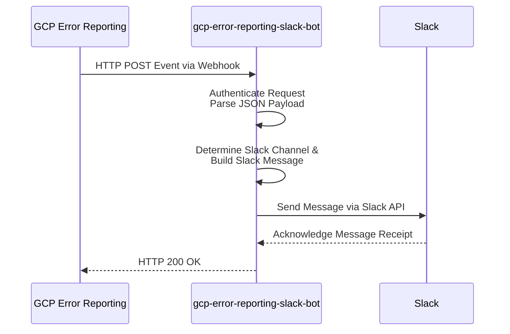

# はじめに

https://qiita.com/nakamasato/items/6c43ca79bd3f449f6103

こちらの記事ですでにGCP Error ReportingをSlack連携できるという記事を書きました。

が、いくつかSlack Notification Channelでは課題があります。

# モチベ

Slack messageが読みづらい

[前回の記事](https://qiita.com/nakamasato/items/6c43ca79bd3f449f6103)でSlack連携したときの通知が以下の感じになります。なんのアプリのなんの問題なのか分かりづらかったです。


:::note info
やっぱりアラートは、一目でなにかわかりやすい方がいいですよね!
:::


# gcp-error-reporting-slack-bot

https://github.com/nakamasato/gcp-error-reporting-slack-bot

という、簡単なSlack appを実装してSlackに送る内容をCustomizeできるようにしました。

# 全体像



Error ReportingではSlackのほかにWebhookでもEventを受けることができるのでこのアプリケーションは、WebhookでError ReportingのEventを受けることにしました。

また、今回は簡単のため、Basic Authを使っています。(Token AuthenticationはTODO)

# 設定方法

## gcp-error-reporting-slack-botのデプロイ

今回はCloud RunにDeployします。

```hcl
locals {
  gcp_error_reporting_slack_bot_env_vars = {
    PROJECT_CHANNEL_MAP = "project_01:CXXXXXXXX,project_02:CZZZZZZZZZ"
    DEFAULT_CHANNEL_ID  = "CYYYYYYYYY"
    BASIC_AUTH_USERNAME = "test-user"
  }
  gcp_error_reporting_slack_bot_env_secrets = {
    SLACK_BOT_TOKEN     = google_secret_manager_secret.slack_bot_token_gcp.secret_id
    BASIC_AUTH_PASSWORD = google_secret_manager_secret.gcp_error_reporing_basic_auth_password.secret_id
  }
}

resource "google_service_account" "gcp_error_reporting_slack_bot" {
  account_id = "gcp-error-reporting-slack-bot"
}

resource "google_secret_manager_secret_iam_member" "gcp_error_reporting_slack_bot_is_secret_accessor" {
  for_each = {
    for secret in [
      google_secret_manager_secret.slack_bot_token_gcp,
      google_secret_manager_secret.gcp_error_reporing_basic_auth_password,
    ] : secret.secret_id => secret.project
  }
  project   = each.value
  secret_id = each.key
  role      = "roles/secretmanager.secretAccessor"
  member    = google_service_account.gcp_error_reporting_slack_bot.member
}

resource "google_cloud_run_v2_service" "gcp_error_reporting_slack_bot" {
  name     = "gcp-error-reporting-slack-bot"
  location = var.region # asia-northeast1

  template {
    containers {
      image = "nakamasato/gcp-error-reporting-slack-bot-dev:1.0.0"

      dynamic "env" {
        for_each = local.gcp_error_reporting_slack_bot_env_vars

        content {
          name  = env.key
          value = env.value
        }
      }

      dynamic "env" {
        for_each = local.gcp_error_reporting_slack_bot_env_secrets
        content {
          name = env.key
          value_source {
            secret_key_ref {
              secret  = env.value
              version = "latest"
            }
          }
        }
      }
    }
    service_account = google_service_account.gcp_error_reporting_slack_bot.email
  }
}

resource "google_cloud_run_service_iam_binding" "gcp_error_reporting_slack_bot_is_public" {
  location = google_cloud_run_v2_service.gcp_error_reporting_slack_bot.location
  service  = google_cloud_run_v2_service.gcp_error_reporting_slack_bot.name
  role     = "roles/run.invoker"
  members = [
    "allUsers"
  ]
}
```

## Notification Channel (webhook)の作成

今回は`webhook_basicauth` というタイプを使います。`labels`に`username`と`url`を設定し、`sensitive_labels`を設定します。 

:::note info
[terraform (monitoring_notification_channel)のぺージ](https://registry.terraform.io/providers/hashicorp/google/latest/docs/resources/monitoring_notification_channel.html)にはwebhookの設定が全然書かれていないので、設定しながら理解しました。あとでPRを出そうと思います。
:::

```hcl
data "google_secret_manager_secret_version" "gcp_error_reporing_basic_auth_password" {
  secret = "gcp-error-reporing-basic-auth-password"
}

resource "google_monitoring_notification_channel" "gcp_error_reporting_slack_bot" {
  display_name = "gcp-error-reporting-slack-bot"
  type         = "webhook_basicauth"
  labels = {
    username = "gcp-error-reporting"
    url      = "${google_cloud_run_v2_service.gcp_error_reporting_slack_bot.uri}/webhook"
  }

  sensitive_labels {
    password = google_secret_manager_secret_version.gcp_error_reporing_basic_auth_password.secret_data
  }
}
```

これでNotification channelの設定は完了です。

## Error ReportingのNotification Channelの設定

こちらは、Terraformが対応していないので、手動で設定します。

https://github.com/hashicorp/terraform-provider-google/issues/12068


## Notification Channelのテスト

Test Connection

Webhookの設定からTest Connectionを送る事ができます。


Cloud LoggingでLogを確認します。


Slackにも通知がきていることを確認できます。
Eventの中身は実際のエラーの内容が入っていないので以下のような空のメッセージになります。


## 実際のSlack通知


## References

- https://github.com/nakamasato/gcp-error-reporting-slack-bot
- https://hub.docker.com/repository/docker/nakamasato/gcp-error-reporting-slack-bot/general
- https://qiita.com/nakamasato/items/6c43ca79bd3f449f6103
- https://registry.terraform.io/providers/hashicorp/google/latest/docs/resources/monitoring_notification_channel.html

